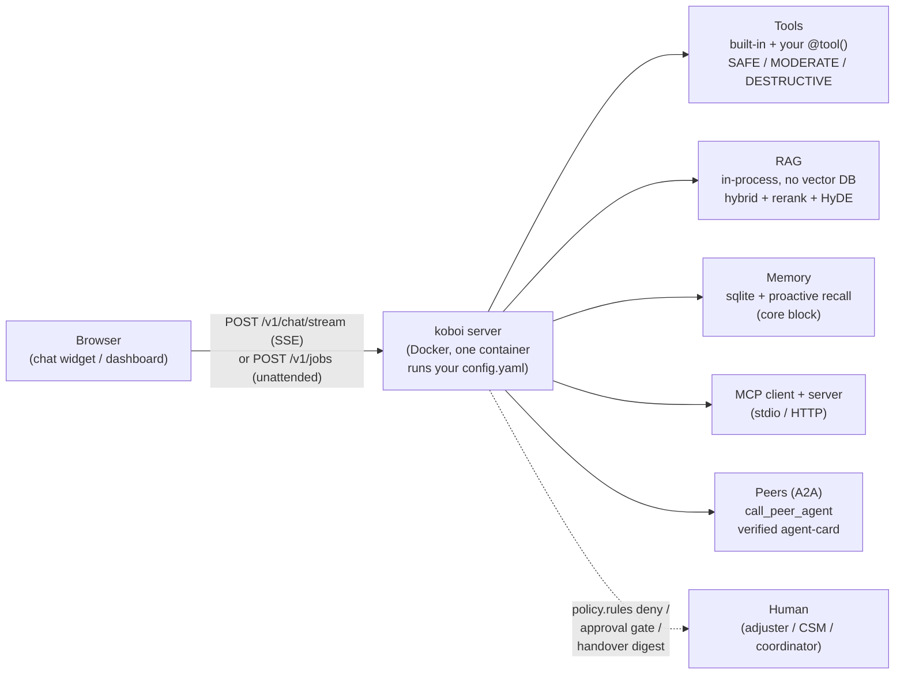

# koboi-projects

Ten real-shape apps — a claims triage that never pays a claim, a resume screen that runs overnight, a concierge that routes work to two other agents over HTTP — each built by consuming [`koboi-agent`](https://github.com/hedypamungkas/koboi-agent) as a dependency, never forking it.

> **Try it now** — one command picks a use case, writes your `.env`, builds, starts, and prints the URL:
>
> ```sh
> curl -fsSL https://raw.githubusercontent.com/hedypamungkas/koboi-projects/main/quickstart.sh | bash
> ```

---

## What koboi-agent is

`koboi-agent` is an MIT-licensed, async-Python **library and self-hostable server** for building agents meant to run unattended — background jobs, long sessions, assistants that touch real systems. You describe the whole stack (model, tools, guardrails, RAG, sandbox, serving, jobs) in one YAML file and run it as a CLI (`koboi run`), a library (`KoboiAgent.from_config(...)`), or a self-hosted FastAPI server (`koboi serve`). It is not a managed platform and not a visual node-graph runtime. Every app in this repo installs it straight from PyPI as `koboi-agent[api]==0.18.2` — no git checkout, no local wheel, nothing vendored.

The thesis these ten apps make visible: **koboi is easy to start with what's built in, and just as easy for an enterprise to extend when the business needs something custom.** Same codebase, both stories.

## The gap these apps exist to show

Most teams building an unattended agent pick a side. Low-code agent builders get you live in an afternoon but lock you in — your guardrails, approval gates, and job plumbing live in their runtime, and they stop bending at the edges. Raw SDK frameworks (LangChain, LlamaIndex, plain provider SDKs) are fully yours, but you rebuild the same plumbing on every project: RAG chunking, input guardrails, rate limits, the approval-before-destructive-tools gate, background jobs, audit hooks.

koboi's bet is that you shouldn't have to choose. Ship the built-in version in an afternoon; when the business needs something the built-in doesn't do, swap in your own tool, hook, or policy rule on the same codebase. No fork, no rewrite. The proof is structural: market-intel is config-only (no custom Python), while insurance-claims, finance-reconciliation, and the A2A concierge reach into the framework via `tools.custom`, `hooks`, `create_app(extra_hooks=...)`, and an MCP client — all without touching koboi core.

## How every app is shaped



A web UI, one koboi container (three for the A2A concierge), and a thin Python package of business-specific tools. koboi core is never modified.

## Run it

**macOS / Linux** (from anywhere):

```sh
curl -fsSL https://raw.githubusercontent.com/hedypamungkas/koboi-projects/main/quickstart.sh | bash
```

**Windows** (PowerShell — the launcher finds WSL2 or Git Bash for you):

```powershell
irm https://raw.githubusercontent.com/hedypamungkas/koboi-projects/main/quickstart.ps1 | iex
```

**From a checkout** (if the repo isn't published yet):

```sh
bash quickstart.sh                                  # macOS / Linux / Git Bash / WSL
powershell -ExecutionPolicy Bypass -File quickstart.ps1   # Windows
```

The wizard checks Docker, clones the repo, asks for your OpenAI/gateway key, builds, starts, waits on the health check, and prints the web + API URLs. It also runs headlessly:

```sh
OPENAI_API_KEY=sk-... bash quickstart.sh --project hr-screening --yes   # one project, no prompts
```

Other commands: `--list` (projects + ports), `--status` (what's running + health), `--logs <project>`, `--down <project> [--purge]`, `--update`, `--help`.

**Manual path** (one project, copy-paste):

```sh
cd ecommerce-support          # any of the ten
docker compose build
docker compose up -d
docker compose ps             # both services healthy
curl -s http://localhost:8001/healthz    # {"status":"ok"}
# open http://localhost:3001 and chat; see that project's README for the smoke-test curl
```

Requires **Docker** ([Docker Desktop](https://docs.docker.com/desktop/) for macOS/Windows, or Docker Engine + the compose plugin on Linux). Read [`docs/00-consuming-koboi-server.md`](docs/00-consuming-koboi-server.md) first — it's the shared contract (frontend ↔ koboi, chat vs. jobs, what's built in vs. what you write) every app below builds on.

## The ten use cases

Every app is a complete full-stack demo around a fictional-but-realistic business. Each links to its folder and design doc.

1. **[`ecommerce-support`](ecommerce-support/)** · [doc](docs/01-ecommerce-retail-support.md) · API `8001` / web `3001`
   *A storefront chat that answers "where's my order" and processes a refund — but pauses every refund for a human sign-off.*
   Showcases: RAG (hybrid + paragraph chunker + embedding cache), input guardrails (`detect_injection` + rate_limit), custom tools with `SAFE`/`DESTRUCTIVE` risk levels and HITL approval, sqlite memory.

2. **[`hr-screening`](hr-screening/)** · [doc](docs/02-hr-recruiting-screening.md) · API `8002` / web `3002`
   *An overnight resume screen that scores candidates into a ranked shortlist — and resumes the run if the container dies mid-batch.*
   Showcases: background jobs (`resume_on_startup`, `timeout_seconds`), restricted sandbox + `git_init` + `rlimits`, custom scoring tools, `extra_hooks` audit trail via a custom entrypoint.

3. **[`finance-reconciliation`](finance-reconciliation/)** · [doc](docs/03-finance-invoice-reconciliation.md) · API `8003` / web `3003`
   *An overnight three-way match that reads invoices and POs from the ERP over MCP, then queues one journal posting for the controller to approve in the morning.*
   Showcases: MCP **stdio client** (read-only shared-system lookups), jobs, the one approvable write kept **local** as a `DESTRUCTIVE` `@tool()` so it triggers the approval pause, audit hook.

4. **[`healthcare-intake`](healthcare-intake/)** · [doc](docs/04-healthcare-patient-intake.md) · API `8004` / web `3004`
   *A pre-visit chat that checks symptoms against clinical protocols and flags urgent cases — and redacts PHI from every response.* (Not medical advice.)
   Showcases: RAG (hybrid + `query_rewrite` + `hyde` + heuristic rerank), custom PHI-redaction **output guardrail**, `chat` mode + `mode.read_only_tools` escape hatch, escalation flag.

5. **[`legal-contract-review`](legal-contract-review/)** · [doc](docs/05-legal-contract-review.md) · API `8005` / web `3005`
   *First-pass redlining against a firm's clause playbook written in Markdown — drafts only, never files.*
   Showcases: **Skills** (the playbook is `SKILL.md` folders, no retriever code), `MODERATE` redline tool (approval), novel-clause flag, jobs.

6. **[`real-estate`](real-estate/)** · [doc](docs/06-real-estate-property-management.md) · API `8006` / web `3006`
   *A buyer chat by day and a nightly batch that drafts listing descriptions and follow-up emails in parallel — nothing published or sent.*
   Showcases: **`delegate_tasks` fan-out** (parallel sub-agents), jobs, `MODERATE` draft tools, restricted sandbox.

7. **[`insurance-claims`](insurance-claims/)** · [doc](docs/07-insurance-claims-triage.md) · API `8007` / web `3007`
   *A P&C FNOL triage that classifies, estimates, fraud-screens, and routes — and never pays a claim on its own.*
   Showcases: **self_healing** (`tool_verification` CRITIC + `critic_llm` on a stronger model), `handover` + `transfer_to_human`, `policy.rules` deny, `jobs.webhooks` (HMAC), RAG.

8. **[`market-intel`](market-intel/)** · [doc](docs/08-market-intelligence-briefing.md) · API `8008` / web `3008`
   *A weekly competitive brief with numbered citations — that says "no sources found" rather than inventing them.*
   Showcases: **deep_research orchestration** (plan → search → fetch → coverage-gate → cited synthesize; the only orchestration mode that injects tools into nodes), web search/fetch, `grounding_check` output guardrail, handover, `jobs.webhooks`. **Config-only — no custom code.**

9. **[`employee-concierge`](employee-concierge/)** · [doc](docs/09-employee-concierge-a2a.md) · API `8009` / web `3009` (peers `8011`/`8012` internal)
   *An internal concierge that routes requests to separate IT and Facilities agents over HTTP — and hard-denies prod-admin access at the argument level.*
   Showcases: **cross-instance A2A** (`call_peer_agent` + signed, HMAC-verified agent-cards), declarative **command hooks** (no Python inside the agent), **proactive memory**, `policy.rules`, handover. Three containers.

10. **[`customer-success`](customer-success/)** · [doc](docs/10-customer-success-renewal.md) · API `8010` / web `3010`
    *Account health, churn-risk scored by N-sample consensus, and a renewal draft that pauses for the CSM — plus an on-request QBR image.*
    Showcases: **proactive memory** (extract/recall/core_block), **self_consistency** voting, `critic_llm`, `grounding_check`, multimodal (mock provider), `MODERATE` outreach (HITL), `jobs.webhooks`.

A structural split worth knowing: **only 8 is orchestrated** (`deep_research` injects web tools into research nodes, so human judgment enters via `handover`, not an approval card). **7 and 10 are single-agent** — 7's tools + RAG + self-healing + handover + policy all fire on the facade path; 10 is the one place an in-chat approval card, self-consistency, and proactive memory compose. **9 is A2A** — a single-agent front door that calls separate peer instances over HTTP.

## What you get for free vs. what you build

**Free (config-only):**

- **RAG** — hybrid retrieval (keyword + semantic) with fixed/sentence/paragraph/semantic chunkers, heuristic or cross-encoder rerank, `query_rewrite` + HyDE, in-process (no vector DB). Grounds answers in your corpus instead of the model's priors.
- **Guardrails** — `detect_injection`, `rate_limit`, PHI/secret redaction, `grounding_check`. Two YAML lines each.
- **self_healing** — retries tool errors; `tool_verification` re-checks results with a separate critic model; `self_consistency` votes N samples. A flaky estimate or a single-sample hallucination doesn't dead-end the run.
- **handover** + `transfer_to_human` — a warm hand-off with a digest when the agent hits its coverage limit.
- **policy.rules** — `deny` hard-blocks (no approval surface); `confirm` needs one.
- **Background jobs** — unattended, `resume_on_startup`, `timeout_seconds`, HMAC-signed `webhooks`. Survive a container restart.
- **Sandbox** — `restricted` workdir + `rlimits` (+ optional seccomp HARD on Linux). Jobs and `peer_invoke` refuse `passthrough`.
- Also: MCP client + server, Skills, multimodal, `deep_research` orchestration, cross-instance A2A, multi-provider LLM with `ProviderPool` failover, SQLite step journal for durable crash-resume, CI-native eval/replay.

**You build (the thin layer):** your business-specific `@tool()` functions, your hooks (`create_app(extra_hooks=[(cb, events)])` or declarative `hooks.on_event` commands), and optionally a custom guardrail. Read-only lookups stay `SAFE` and auto-run; writes you want governed sit at `MODERATE`/`DESTRUCTIVE` and pause for a human over chat. Examples in this repo: ecommerce refunds (DESTRUCTIVE), CS outreach (MODERATE), legal redlines (MODERATE); finance keeps its one write local (not MCP) precisely so it can carry DESTRUCTIVE and trigger the gate.

## Feature → use-case map

| koboi-agent capability | Proven by |
|---|---|
| RAG (hybrid + chunkers + rerank + query_rewrite/HyDE + embedding cache) | ecommerce-support, healthcare-intake, insurance-claims |
| Background jobs (autonomous, resume_on_startup, timeout, durable) | hr-screening, finance-reconciliation, legal-contract-review, real-estate, insurance-claims, market-intel, customer-success |
| Restricted sandbox (+ git_init + rlimits) | hr-screening, finance-reconciliation, real-estate, insurance-claims, market-intel, customer-success, employee-concierge (peers) |
| MCP client (stdio) | finance-reconciliation |
| Skills (Markdown playbook, progressive disclosure) | legal-contract-review |
| `delegate_tasks` parallel fan-out | real-estate |
| Input guardrails (detect_injection + rate_limit) | ecommerce-support, insurance-claims |
| Output guardrails (PHI redaction / grounding_check) | healthcare-intake, market-intel, customer-success |
| Custom `@tool()` with SAFE/MODERATE/DESTRUCTIVE + HITL approval | ecommerce-support, hr-screening, finance-reconciliation, legal-contract-review, real-estate, insurance-claims, customer-success |
| `policy.rules` deny gate | insurance-claims, employee-concierge |
| self_healing (tool_verification / self_consistency + critic_llm) | insurance-claims, customer-success |
| self_consistency (N-sample voting) | customer-success |
| handover + transfer_to_human | insurance-claims, market-intel, employee-concierge, customer-success |
| jobs.webhooks (HMAC-signed callbacks) | insurance-claims, market-intel, customer-success |
| deep_research orchestration (plan/search/fetch/cite) | market-intel |
| Cross-instance A2A (call_peer_agent + verified agent-card) | employee-concierge |
| Declarative command hooks (on_event) | employee-concierge |
| Proactive long-term memory (extract/recall/core_block) | employee-concierge, customer-success |
| Multimodal generation (mock provider) | customer-success |
| Named provider pool + critic_llm failover (fail-soft) | insurance-claims, customer-success |
| Custom entrypoint + extra_hooks (audit trail) | hr-screening, finance-reconciliation |
| context.smart_truncation | healthcare-intake, insurance-claims, employee-concierge, customer-success |
| Config-only app (no custom code) | market-intel |

## What's real vs. demo

**Real (verified end-to-end against a live LLM):** `koboi-agent==0.18.2` from PyPI with no fork; real LLM calls via your gateway; real approval gates (`pending_approval` SSE → `POST /v1/sessions/{id}/approve`); real `policy.rules` hard-deny; real HMAC-signed webhooks; real A2A HTTP between containers; real RAG retrieval over the seed docs; real sqlite memory and proactive recall. The first six apps (1-6) were verified earlier; **apps 7-10 were verified end-to-end on 2026-07-18** on a shared gateway.

**Demo / fictional (by design):** every business is fictional (Anvil & Co, Northstar Talent, Beacon Mutual, Riverside Family Clinic, etc.) with scripted seed data; the finance ERP MCP server returns canned lookups; market-intel's web search defaults to `mock` (set `WEB_SEARCH_PROVIDER=brave|firecrawl` + a key for live research); customer-success media is `mock`; employee-concierge tickets write to a local JSONL file (no real ServiceNow); webhooks POST to a URL you point at a receiver. All ten configs ship with `server.auth_required: false` for local POCs (UC9's concierge is the single exception — A2A forces it on).

**Honest koboi limits the build surfaced (documented in each README's "Deviations"):**

- **Orchestration `agents[].system_prompt` / `rag` / `tools` is dead config in 0.18.2.** The local sub-agent builder (`koboi/orchestration/orchestrator.py:478` → `AgentFactory.create_agent`) only knows four hardcoded demo agents; the config-aware `_build_agent_from_def` has zero callers. A live DAG run emitted `tool_calls: null`. That's why insurance-claims is single-agent and only market-intel (`deep_research`) is the orchestration showcase.
- **A2A-enabled servers force `auth_required: true`** — with outbound peers configured, the auth middleware demands a Bearer on every endpoint; `false` cannot override it (employee-concierge).
- **`peer_invoke` on an act-mode agent refuses `sandbox.backend: passthrough`** — both UC9 peers set `restricted` (`koboi/server/app.py:_run_peer_agent`, same unattended-safety gate as jobs).
- **`tools.builtin` is a hard gate, not a default-on allowlist** — empty/absent means zero builtins (load-bearing for real-estate's `delegate_tasks` and ecommerce/legal memory).
- **Autonomous jobs can never pause for approval** — anything risky is designed out, routed to chat, or `policy.rules: deny`-gated.
- **Streaming text reaches the browser token-by-token before output guardrails run** — a PHI/secret guardrail affects the stored message and final `complete` event, not already-streamed text (load-bearing caveat for healthcare-intake).
- **Single-node hot state** — pools, jobs, idempotency, and the step journal are in-process; not multi-node HA. RAG is in-process (filesystem/HTTP/S3 sources only). MCP auth is static-Bearer or OAuth2 client-credentials; only the stdio transport has a proven shipped example.
- **`docs/00` is partly stale** relative to the 10-app set — it still says "all six apps" and "none wire up a webhook"; UC7/8/9/10 do wire `jobs.webhooks`.

For the full layered reproduction runbook (mock/unit config+compile pass → integration boot pass → real-LLM end-to-end, with exact `curl` smoke tests and browser walkthroughs), see [`TEST.md`](TEST.md).

## Status

All ten apps are built and real-LLM-verified end-to-end against `koboi-agent[api]==0.18.2` from PyPI. Each project directory has its own `docker-compose.yml`, `README.md` with exact run + smoke-test steps, and a "Deviations" section documenting where real koboi behavior differed from the design doc. The framework itself lives at [`hedypamungkas/koboi-agent`](https://github.com/hedypamungkas/koboi-agent).
