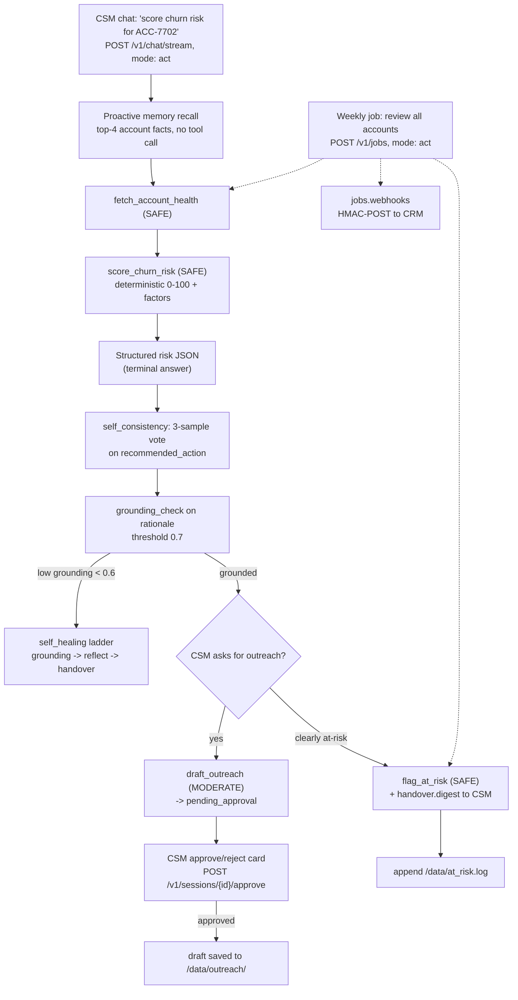

# SaaS Customer Success — Account Health & Renewal Outreach

> **Try it:** `bash quickstart.sh --project customer-success` — or, from inside the dir, `docker compose up -d --build`. Backend on `http://localhost:8010`, UI on `http://localhost:3010`. Needs Docker + an OpenAI/gateway key.

A weekly account-health pass that scores each account's churn risk, recommends an action, drafts customer-voiced outreach, and flags at-risk accounts for the CSM — and never sends a customer-facing message until a CSM clicks approve.

## What this app does

It fetches account signals (usage, support load, sentiment, renewal proximity), scores churn risk deterministically, votes a recommended action across three samples, and drafts outreach **only after a CSM approves it**. A clearly at-risk account gets warm-handed to its CSM with a summary, and a weekly unattended job re-scores every account and HMAC-POSTs the result to your CRM.

It does not send email, post to Slack, or write to a CRM record on its own. Customer-facing copy is human-gated; everything else is assessment and routing.

## The scenario

Tideline (a fictional mid-market B2B SaaS vendor) sells a usage-heavy product to about 1,500 paying accounts, split across three CSMs — roughly 500 accounts each. Every Monday a CSM opens a spreadsheet, eyeballs usage trend, open tickets, NPS, and sentiment for each account, types a churn-risk score, and drafts a check-in note for the wobbly ones. At 500 accounts per person that pass gets done shallow or skipped, and renewal surprises happen because no one re-scored the account that quietly slid from "stable" to "-18% active users, six open tickets, 38 days to renewal." The hard parts aren't scoring (the rules are known) — they're keeping each account's relationship history in mind across visits, not over-reacting to one noisy score, and keeping human control over anything written in a customer's voice.

This demo ships three accounts that span the spectrum: `ACC-7701` (Crestline Logistics, healthy), `ACC-7702` (Bluepeak Media, declining), `ACC-7703` (Northgate Health, flat). They live in `src/cs_ext/tools.py` as a mock store — there is no real CRM behind them.

## How teams handle this today

Customer-success platforms (Gainsight, ChurnZero, Totango, Planhat) are the natural home for this work, and they're genuinely good at it: they own the account graph, the health-score formula, and the playbook automation that pings a CSM when a signal crosses a threshold. What they don't give you is a flexible, code-level reasoning layer over those signals — an explainable rationale that ties the score to the *specific* signals this week, a consensus-voted judgment on a borderline account, or a natural-language outreach draft that reads like a human wrote it rather than a merge field.

The other path is a custom LLM app on top of your data. It reasons well, but you rebuild the same plumbing on every project: the approval-before-sending gate, the durable per-account memory, the unattended background job, the audit trail. And you ship it without a safety net.

## The gap

CSPs score cleanly but reason shallowly; a custom LLM app reasons well but ships without the approval gate, the per-account memory, or the unattended job — so you run both and rebuild the glue between them every time.

## Enter koboi-agent

[koboi-agent](https://github.com/hedypamungkas/koboi-agent) is a self-hostable, async-Python agent library (install `koboi-agent[api]==0.18.2` from PyPI). You describe the whole stack — model, tools, guardrails, memory, jobs — in one YAML, and run it as a CLI, a library, or a FastAPI server. This app is the natural shape for account health: per-account memory, the consensus vote, the approval-before-sending gate, and the unattended weekly review are all built in. You get a working health pass in an afternoon, and you keep the same codebase when you want to bend the scoring formula or the outreach voice.

## What you get for free

| Koboi feature | The pain it removes | Config (verified in `config/agent.yaml`) |
|---|---|---|
| **`memory.proactive`** (extract + recall + core_block) — the headline | The agent remembers each account's durable facts (CSM, commitments, sentiment, history) across visits without re-asking. It auto-extracts facts after each run and recalls the top-4 each turn (no tool call), with an always-in-context core block. | `top_k:4`, `min_score:0.2`, `max_facts:200`, SQLite at `/data/koboi_memory.db` |
| **`self_healing.self_consistency`** | A high-stakes structured recommendation gets three samples and a vote, not one noisy answer. Runs on the single-agent facade loop only. | `n_samples:3`, `max_concurrency:3`, `modes:[act,auto]` |
| **`providers.critic` + `self_healing.critic_llm: critic`** | The CRITIC (self-consistency / low-grounding reflection) runs on a distinct named client pointed at a **stronger** model (default `claude-sonnet-5`), so the verifier is decoupled from the generator. Fail-soft — reuses the main client on any build error. | `providers.critic` + `critic_llm: critic` |
| **`guardrails.output` (grounding_check)** | The churn-risk rationale stays faithful to the fetched signals — not invented. | `threshold:0.7` |
| **`self_healing` ladder + `fail_soft` + `graceful_max_iter`** | On low grounding (`< 0.6`) the ladder escalates grounding → reflect → handover instead of looping forever; it degrades gracefully. | `triggers.low_grounding.threshold:0.6`, `ladder:{}` |
| **`media` (image, mock provider)** | A QBR summary image can be generated on request. Mock so the build runs offline; budget-capped. | `provider:mock`, `max_images:10`, `max_cost_usd:2.0`, `storage.backend:local` |
| **`handover` (detection + digest)** | At-risk accounts route to the CSM with a warm summary, not a bare flag. | `coverage_threshold:0.5`, `digest.enabled:true` |
| **`jobs` + `jobs.webhooks`** | The weekly account review runs unattended, resumes on startup, and HMAC-POSTs its terminal status to the CRM. | `resume_on_startup:true`, `timeout_seconds:900`, `events:[completed,failed,timed_out]`, HMAC-signed POST |
| **`embedding` + `context.smart_truncation` + `sandbox.restricted` + `audit`** | Proactive recall embeds each turn; context stays under 8000 tokens; the audit trail lands at `/data/audit/cs.db`. Restricted sandbox is required for the job and inert for these plain-Python tools. | `max_context_tokens:8000`, `sandbox.backend:restricted`, `audit.db_path:/data/audit/cs.db` |
| **`agent.mode: act` + `max_iterations:10`** | `act` is required so the CSM chat can reach the `MODERATE` `draft_outreach` tool — `chat` would block custom tools. | `mode:act`, `max_iterations:10` |

## What you build

Four custom tools in `src/cs_ext/tools.py` (loaded via `tools.custom: [{module: cs_ext.tools}]`):

- `fetch_account_health` — **SAFE**. Reads the raw signals (usage, support, sentiment, renewal) for an account.
- `score_churn_risk` — **SAFE**. Deterministic 0–100 score plus contributing factors. The scoring is rule-based and stable; the *judgment* (`recommended_action`) is what the agent reasons about and what gets sampled and voted.
- `draft_outreach` — **MODERATE** (the HITL pause). Drafts customer-facing copy; koboi emits `pending_approval` and the draft is saved only after the CSM's approve/reject card posts to `/v1/sessions/{id}/approve`. Nothing is ever sent — it's written to `/data/outreach/`.
- `flag_at_risk` — **SAFE**. Appends the account to `/data/at_risk.log` and routes a warm summary to the CSM (the `handover.digest` path).

The system prompt in `config/agent.yaml` forces a single bare-JSON risk object — `{account_id, churn_risk_score, risk_level, recommended_action, rationale}` — so `self_consistency` has a stable thing to vote on.

## The flow



Read it top-down for the live CSM chat, and the dotted lines for the unattended weekly job (which runs assessment + flagging — it can't pause for an approval, so it never drafts outreach).

## Run it

**One-liner** (from the repo root, or anywhere once published):

```bash
bash quickstart.sh --project customer-success
# or: curl -fsSL https://raw.githubusercontent.com/hedypamungkas/koboi-projects/main/quickstart.sh | bash
```

**Manual path:**

```bash
cd customer-success
cp .env.example .env          # fill OPENAI_API_KEY / OPENAI_MODEL + EMBEDDING_* (proactive recall needs embeddings)
docker compose build
docker compose up -d
```

- Backend: `http://localhost:8010` · Frontend: `http://localhost:3010`

### Smoke test

```bash
# 1) health
curl -sf http://localhost:8010/healthz

# 2) structured churn-risk assessment (consensus-voted). mode:"act" is required.
curl -s -N -X POST http://localhost:8010/v1/chat/stream -H "Content-Type: application/json" \
  -d '{"message":"Score the churn risk for ACC-7702 and recommend an action.","mode":"act"}'
# expect: {"account_id":"ACC-7702","churn_risk_score":<high>,"risk_level":"high",
#          "recommended_action":<a recommended action string>,"rationale":"..."}
```

Expected for `ACC-7702` (Bluepeak Media): a high-band risk level — the deterministic score climbs on declining usage, -18% active users, six open tickets, NPS 5, and frustrated sentiment, with renewal only 38 days out. `ACC-7701` lands low; `ACC-7703` lands in a flat/middle band.

```bash
# 3) outreach draft -> pending_approval for draft_outreach (MODERATE). Grab X-Session-Id.
SID=<session-id-from-the-previous-response-header>
curl -s -N -X POST http://localhost:8010/v1/chat/stream -H "Content-Type: application/json" \
  -H "X-Session-Id: $SID" \
  -d '{"message":"Draft an email outreach for ACC-7702 focusing on their usage decline and a QBR offer.","mode":"act"}'
# a pending_approval event fires with an approval_id -> resolve it:
curl -s -X POST http://localhost:8010/v1/sessions/$SID/approve -H "Content-Type: application/json" \
  -d '{"approval_id":"<approval_id from pending_approval>","decision":"approved","scope":{}}'
docker compose exec koboi cat /data/outreach/ACC-7702-*.json   # status: approved-draft-saved

# 4) weekly account-review job (assessment + flagging only — it can't pause to draft)
JOB=$(curl -s -X POST http://localhost:8010/v1/jobs -H "Content-Type: application/json" \
  -d '{"message":"Review all tracked accounts; score churn risk; flag any at-risk accounts for their CSM.","mode":"act"}' \
  | python3 -c 'import sys,json;print(json.load(sys.stdin)["job_id"])')
curl -s "http://localhost:8010/v1/jobs/$JOB"
docker compose exec koboi cat /data/at_risk.log

docker compose down
```

If proactive recall isn't surfacing, check `docker compose logs koboi` — recall needs a working embedding endpoint.

## Caveats / what's real vs demo

- **Single-agent by design, and load-bearing.** `self_consistency`, the `pending_approval` card, and `memory.proactive` only behave on the single-agent facade path. `orchestration.enabled` would route chat through `_run_orchestrator`, which returns a final `RunResult` and emits **no** `pending_approval`. This is the one new use case where HITL approval + self-consistency + proactive memory all compose, so it deliberately stays single-agent. (UC1-3 chose orchestration and route human judgment through `transfer_to_human` + `policy.rules` instead.)
- **Live-verified (2026-07-18, real LLM via the shared gateway).** `fetch_account_health` → `score_churn_risk` (high) → a clean structured JSON matching the schema; then `draft_outreach` (MODERATE) → `pending_approval` → resolved via `POST /v1/sessions/{id}/approve` (`decision: approved`) → draft saved to `/data/outreach/ACC-7702-*.json` (`status: approved-draft-saved`).
- **`self_consistency` is wired per config but was not the focus of the live run** — the structured answer was produced directly. The system prompt instructs a single-JSON-object risk assessment (so voting has a stable target), and `score_churn_risk` does the deterministic scoring; the `recommended_action` judgment is what gets sampled + voted. Live-verify it specifically if it's load-bearing for you.
- **`media` uses the `mock` image provider** so the build runs offline. `generate_image` surfaces when `media.enabled` is true; live-verify the exact tool surfacing in your environment if QBR image generation matters. The live run did **not** request an image.
- **`draft_outreach` is the HITL pause over chat.** In the weekly *job* path it can't pause (jobs never do — anything risky has to be designed out, routed to chat, or `policy.rules`-denied), so the job is scoped to assessment + flagging, not sending drafts.
- **`sandbox.restricted` is required for the weekly job to run** (jobs refuse `passthrough`), but it's inert for these plain-Python tools — they don't spawn processes.
- **`server.auth_required: false` is local-only** for the smoke-test POC. Production flips to `true` and mints keys via `koboi keys create`.
- **Three demo accounts only** (`ACC-7701/7702/7703` in `src/cs_ext/tools.py`); no real CRM. The `jobs.webhooks` sink is configurable via `CRM_WEBHOOK_URL` / `CRM_WEBHOOK_SECRET` in `.env` for a real receiver.
- **Docs alignment.** `docs/10-customer-success-renewal.md` is followed; the proactive-memory headline is the differentiator vs UC1-9.

## Layout

```
customer-success/
  config/agent.yaml          # single-agent: proactive memory + self_consistency + media + handover + jobs.webhooks
  src/cs_ext/tools.py        # fetch_account_health, score_churn_risk, draft_outreach (MODERATE), flag_at_risk
  data/seed/                 # reference playbook material used by the scoring/action logic
  backend/Dockerfile         # koboi-agent[api]==0.18.2 + cs_ext; bare `koboi serve`
  frontend/                  # accounts panel + CSM chat with inline approve/reject card, vanilla JS
  docker-compose.yml         # API on :8010, UI on :3010
```

Runnable build for [`docs/10-customer-success-renewal.md`](../docs/10-customer-success-renewal.md). Read that and [`docs/00-consuming-koboi-server.md`](../docs/00-consuming-koboi-server.md) first.