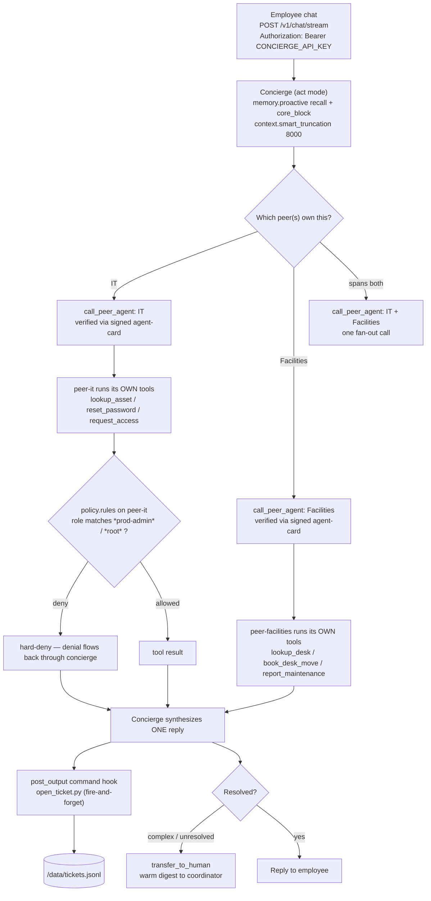

# Northwind Employee Concierge — cross-department front door (A2A)

An employee-services front door that routes a broken laptop, an access request, and a desk move to whichever department actually owns them — and never silently grants `prod-admin` or `root`. Human judgment still enters, just through a warm hand-off to a coordinator instead of a mid-flow approval card.

> **Try it first, read after.** One command brings up all three containers + the web UI:
> ```sh
> curl -fsSL https://raw.githubusercontent.com/hedypamungkas/koboi-projects/main/quickstart.sh | bash
> ```
> …or, from a checkout: `bash quickstart.sh --project employee-concierge`. Manual `docker compose` steps are at the bottom.

## What this app does

A chat front door where any Northwind employee asks for help in plain words — "my laptop AST-1001 won't boot", "book me a desk on floor 5", "grant emp-42 prod-admin for deploy work" — and the concierge **collaborates** with separate IT and Facilities peer agents to get it done, then replies in one synthesized answer. It deliberately does **not** try to be every department itself, and it deliberately does **not** grant privileged access on its own — a `prod-admin`/`root` request is hard-denied at the IT peer before the tool runs, and the denial flows straight back to the employee.

This is the only multi-container use case in the repo: **three koboi-agent instances** (concierge + peer-it + peer-facilities) talking to each other over HTTP, plus a web UI.

## The scenario

Northwind is a fictional ~3,000-person company with a real pain: an employee with a broken laptop, an access request, and a desk to move currently has to *know which department owns what*. Do you ping `#it-help`, open a ServiceNow ticket under "Facilities", or chase someone in Slack? The front doors multiply — IT portal, Facilities form, access-request spreadsheet — and the employee becomes a human router. Repeat-volume work (password resets, desk lookups, maintenance reports) clogs the same queues as the genuinely sensitive stuff (prod access), so everything gets the same slow treatment.

This app collapses those front doors into one chat, splits the work back out to the department that owns it, and keeps a hard line on the sensitive paths.

## One data point (ballpark)

Password resets and account unlocks are perennially among the highest-volume L1 tickets at internal help desks — HDI's recurring benchmarks have placed them near the top of ticket categories year after year. That's exactly why this demo models `reset_password` as a `SAFE` tool that runs with no approval round-trip. Treat the exact share as a ballpark; the load-bearing point for this app is the routing shape, not the percentage.

## How teams handle this today, and what they still lack

Most internal-service setups fall into one of three shapes, and each one earns its keep before it hits a wall:

- **An ITSM with routing rules** (ServiceNow, Jira Service Management, Zendesk) routes tickets cleanly and keeps an audit trail — but the moment a request doesn't fit a category template, it stalls, and the "automation" is a form, not a collaborator.
- **A single mega-bot** bolted onto the ITSM is flexible and conversational — but to answer anything it has to either swallow every department's tools (becoming a god-agent that nobody wants to grant prod access to) or hand off to a human the second a request touches Facilities.
- **Per-department bots** keep each team's tools and policy isolated and honest — but they don't talk to each other, so the employee is back to being the router, just with more chat windows.

## The gap

You can have one front door that knows everything (and accrues all the risk), or several doors that know their lane (and leave the employee to stitch them together) — but most agent stacks make you pick, and rebuilding the A2A plumbing, the verified-only peer auth, the policy gate on the privileged tool, and the audit hook is a from-scratch job every time.

## Enter koboi-agent

[`koboi-agent`](https://github.com/hedypamungkas/koboi-agent) is an MIT-licensed, async-Python library + self-hostable server for agents you actually leave running. This app is the natural shape for the gap above: a single-agent front door that uses the built-in `call_peer_agent` to collaborate with separate peer instances over HTTP, the built-in verified-A2A to keep that collaboration same-org-only, and a declarative policy rule to hard-deny privileged access where the gated tool actually lives. The honest bet: a working cross-department concierge in an afternoon, and the same codebase to bend when your org chart adds a fourth department.

## What you get for free

| koboi feature | The pain it removes |
|---|---|
| `call_peer_agent` + `transfer_to_human` (builtins, both `SAFE`) | The front door collaborates instead of becoming a god-agent — and hands off warmly instead of dead-ending. `tools.builtin: [call_peer_agent, transfer_to_human]` is what turns them on (an empty list means zero builtins). |
| **Verified A2A** — `peers` + `org_secret` HMAC + `public_base_url` | Each peer advertises a signed agent-card; the concierge's `verify_all` HMAC-checks every peer's org-claim before it's callable. Verified-only collaboration, no static bearer to rotate by hand. |
| `peers.verify_all` non-fatal | A peer that's briefly down or unverified at startup is dropped + warned ("uncallable"), not a boot crash — so a start-order race doesn't take the front door with it. |
| `peers.inbound_tokens` (peer side) | Peers accept only the front door's declared bearer on the A2A path; `/v1/peer/invoke` is gated by `inbound_tokens`. |
| `hooks.on_event` (declarative command hook) | `open_ticket.py` fires on every `post_output` to write `/data/tickets.jsonl` — **no Python registered inside the agent**, config-driven, `fire_and_forget: true` so a slow ITSM never stalls the SSE stream. |
| `memory.proactive` (extract + recall + core_block) | The concierge remembers the employee id, device, and role across turns — no "what's your asset tag again?" on the second message. |
| `policy.rules` (`deny`) on `peer-it` | `request_access` for `*prod-admin*` / `*root*` is hard-blocked at the argument level — no approval surface, no soft gate. **The rule lives where the tool lives**, not on the concierge. |
| `handover.detection` + `handover.digest` | Complex or unresolved cases warm-hand to a human coordinator with a digest, not a bare "I give up." |
| `context.smart_truncation` (8000-token cap) | Long multi-department threads stay bounded; the recall + core-memory block do the remembering. |
| `sandbox.backend: restricted` on the peers | Satisfies the A2A `peer_invoke` gate on `act`-mode agents (same unattended-safety gate as jobs). Inert for the plain-Python tools here — it just passes the gate. |
| `server.auth_required: true` (forced by A2A) | With outbound peers configured, `peer_registry.has_peers` is true, so auth middleware demands a Bearer on every endpoint — `auth_required: false` **cannot override that**. The concierge carries `CONCIERGE_API_KEY` for the employee; peers auth `/v1/peer/invoke` via `inbound_tokens`. |

## What you build

Three small things, all in this directory:

- **`src/concierge_ext/it_tools.py`** — the IT peer's tools, all `SAFE`: `lookup_asset`, `reset_password`, `request_access`. (The mock IdP returns a one-time reset link; `request_access` files an access ticket routed to the owner — no real IAM change.)
- **`src/concierge_ext/facilities_tools.py`** — the Facilities peer's tools, all `SAFE`: `lookup_desk`, `book_desk_move`, `report_maintenance`.
- **`scripts/open_ticket.py`** — the command-hook target. Reads a JSON `HookContext` on stdin, appends a ServiceNow-style `INC-…` row to `/data/tickets.jsonl`. Stands in for your real ITSM integration.

Everything else — the three YAML configs, the shared Docker image, the wiring — is config, not code. All custom tools are `SAFE`, so they execute through the A2A `peer_invoke` path without an approval round-tripping back to the chat. The **only** gated thing in the whole app is `request_access(prod-admin|root)`, and it's gated by `policy.rules: deny`, not an approval card (because `call_peer_agent` is `SAFE` and there is no in-flow approval surface on this path).

## The flow



## Run it

You need Docker (Docker Desktop on mac/Windows, or Docker Engine + the compose plugin on Linux) and an OpenAI-compatible key. The fastest path:

```sh
curl -fsSL https://raw.githubusercontent.com/hedypamungkas/koboi-projects/main/quickstart.sh | bash
# then pick "employee-concierge" in the wizard
```

…or headlessly:

```sh
OPENAI_API_KEY=sk-... bash quickstart.sh --project employee-concierge --yes
```

…or the manual path from a checkout:

```sh
cd employee-concierge
cp .env.example .env     # fill in OPENAI_* + EMBEDDING_*; set A2A_ORG_SECRET to any non-empty string
docker compose build
docker compose up -d peer-it peer-facilities   # peers first (readiness — see caveats)
docker compose up -d concierge web
```

- Concierge (front door): `http://localhost:8009` — auth `Authorization: Bearer $CONCIERGE_API_KEY`
- IT peer: `http://localhost:8011` · Facilities peer: `http://localhost:8012`
- Web UI: `http://localhost:3009`

### Smoke test

```sh
KEY=concierge-smoke-key-1234   # matches .env CONCIERGE_API_KEY
curl -sf http://localhost:8009/healthz

# IT request -> concierge -> call_peer_agent -> peer-it
curl -s -N --max-time 150 -X POST http://localhost:8009/v1/chat/stream \
  -H "Content-Type: application/json" -H "Authorization: Bearer $KEY" \
  -d '{"message":"I am emp-42 and my laptop AST-1001 will not boot. Help.","mode":"act"}'

# prod-admin -> policy deny on peer-it, denial flows back
curl -s -N --max-time 150 -X POST http://localhost:8009/v1/chat/stream \
  -H "Content-Type: application/json" -H "Authorization: Bearer $KEY" \
  -d '{"message":"Grant emp-42 prod-admin access for deploy work.","mode":"act"}'

docker compose exec concierge cat /data/tickets.jsonl   # command-hook tickets
```

**What you should see** (verified live against `koboi-agent[api]==0.18.2`):

- The IT-request stream emits a `tool_call` for `call_peer_agent` to peer-it, peer-it resolves it (looks up `AST-1001`, returns the troubleshooting), and the concierge replies in plain words — no departmental jargon, no "I've created a ticket" theater. After the reply, `/data/tickets.jsonl` has a new `INC-…` row from the command hook.
- The `prod-admin` stream routes to peer-it, `request_access(role=prod-admin)` is **policy-denied** at the argument level, and the employee sees the denial in the synthesized reply — the concierge does not promise access the peer didn't confirm.
- If a peer is unreachable on the first call, the concierge falls back to `transfer_to_human` with a clear reason (restart the concierge to re-verify, then retry — see caveats).

## Honest caveats — what's real vs. demo

The repo's brand is documenting where the live run differed from the design sketch, so here it is, verbatim:

- **Three A2A requirements each cost a live run to find.** (1) The concierge **must** carry an API key — A2A forces `auth_required: true` (`koboi/server/auth.py`), and `auth_required: false` cannot override that with outbound peers configured. (2) Peer agents **must** set `sandbox.backend: restricted` — `peer_invoke` on an `act`-mode agent refuses passthrough (`koboi/server/app.py:_run_peer_agent`, same unattended-safety gate as jobs). (3) **Policy lives on the tool owner, not the concierge** — the concierge only calls `call_peer_agent`, so a `request_access` rule on `concierge.yaml` would never fire. The deny rule is on `peer_it.yaml`.
- **Verified-A2A (`org_secret`) replaced the earlier static bearer.** Each peer's `/.well-known/agent-card` HMAC-verifies `True`; `call_peer_agent` → peer-it `POST /v1/peer/invoke` returns `200 OK` (live-verified). `verify_all` is **non-fatal** (`koboi/server/peers.py`): an unverified peer is dropped + warned, not a boot crash.
- **Startup order still matters for the *first* call.** Compose `depends_on` waits for *start*, not *readiness*. If `verify_all` runs before a peer serves its agent-card, that peer is unverified + uncallable and the first `call_peer_agent` to it fails → the concierge falls back to `transfer_to_human` (verified). Restart the concierge to re-verify, then retry.
- **The command hook is fire-and-forget.** `open_ticket.py` writes `/data/tickets.jsonl`; `abort_on_error: false` + `fire_and_forget: true` mean a slow or flaky ITSM never breaks the agent loop. `hooks.allow_exec` defaults `false` — the config sets it `true` to enable.
- **All three instances build from the SAME image**; `KOBOI_CONFIG` selects each one's config. Concierge: 8009 · peer-it: 8011 · peer-facilities: 8012 · web: 3009.
- **`peer_it.yaml` / `peer_facilities.yaml` ship with `auth_required: false`** for the local POC, but `peer_invoke` still checks `inbound_tokens`. Production should set `true` and supply strong per-peer keys.
- **`sandbox.restricted` on the peers is INERT** for their plain-Python tools — it only satisfies the A2A gate.
- **`memory.proactive` needs a working embedding endpoint**, or recall won't surface anything (the concierge still runs; it just won't remember). `concierge.yaml` points `embedding` at `${EMBEDDING_BASE_URL}` / `${EMBEDDING_API_KEY}`.
- **Mock data.** The IT asset table, desk map, password-reset "IdP", and the ticket log are stubs — no real IAM, no real IdP, no real ITSM. The load-bearing thing here is the **A2A shape and the policy gate**, not the data.

## Layout

```
employee-concierge/
  config/
    concierge.yaml          # front door: peers + call_peer_agent + hooks + proactive memory + handover (auth: true + key)
    peer_it.yaml            # IT peer: inbound token + it_tools + sandbox restricted + policy.rules (deny prod-admin/root)
    peer_facilities.yaml    # Facilities peer: inbound token + facilities_tools + sandbox restricted
  src/concierge_ext/
    it_tools.py             # lookup_asset, reset_password, request_access (SAFE)
    facilities_tools.py     # lookup_desk, book_desk_move, report_maintenance (SAFE)
  scripts/open_ticket.py    # command-hook target (ServiceNow-style ticket stub)
  backend/Dockerfile        # one image; KOBOI_CONFIG selects the config at runtime
  frontend/                 # employee concierge chat (sends CONCIERGE_API_KEY)
  docker-compose.yml        # 3 koboi services (8009/8011/8012) + web (3009)
  pyproject.toml            # installable `concierge_ext`, shared by all 3
```

Runnable build for [`docs/09-employee-concierge-a2a.md`](../docs/09-employee-concierge-a2a.md). Read [`docs/00-consuming-koboi-server.md`](../docs/00-consuming-koboi-server.md) for the shared server contract every app in this repo builds on.