# Finance & Accounting Ops — Vendor Invoice Reconciliation

An overnight invoice reconciliation that matches vendor bills to POs and flags the mismatches — and never posts a journal entry without the controller's explicit click.

> **Try it:** `curl -fsSL https://raw.githubusercontent.com/hedypamungkas/koboi-projects/main/quickstart.sh | bash` (pick *Finance reconciliation*), or `bash quickstart.sh --project finance-reconciliation` from a checkout. Smoke-test curls at the bottom of this page.

## What this app does

koboi connects to Ledgerline's ERP, runs a three-way match (invoice vs. PO vs. delivery) on demand, and writes an append-only audit row for every tool call that runs. Read-only lookups fly with no friction. The one operation that actually moves money — posting a journal entry — is marked `DESTRUCTIVE`, so koboi pauses it, sends a `pending_approval` event, and waits for the controller to approve over chat. The agent never posts on its own.

## The scenario

Ledgerline Manufacturing is a mid-size parts maker. Its four-person finance team closes the books every month by matching roughly 500 vendor invoices against purchase orders and delivery records by hand — days of tab-switching and spreadsheet cross-checks. They want the matching automated, but they will not let software post anything to the general ledger on its own: the controller has to review each flagged invoice and approve or reject the posting herself.

That's the hard constraint the rest of this page is engineered around. Reads should be cheap and shared. The write should be gated, auditable, and never automatic.

## One number, honestly framed

External AP-benchmark surveys (Ardent Partners and the like publish one each year) put fully-manual invoice processing somewhere in a band of roughly ten to fifteen dollars per invoice, dropping to a few dollars once a match is touchless. Treat that as a ballpark range drawn from external industry-survey averages — it is not a figure measured for this app or asserted by koboi, and there is no single citation behind it. The load-bearing point for this app is the gap between the two bands, not the exact dollar. At 500 invoices a month, closing that gap is a controller's worth of evenings.

## How teams handle this today — and what they still lack

- **ERP-builtin AP modules** (SAP, NetSuite, Oracle) match cleanly inside one system, but they assume the invoice, PO, and receipt all live in *their* database. The moment a vendor, a warehouse, or a freight record sits elsewhere, you're back to spreadsheets.
- **RPA bots** (UiPath, Automation Anywhere) bridge those gaps by screen-scraping and rule-matching, and they handle volume well — but the guardrails, the approval card, and the audit trail are project plumbing you rebuild on every deploy, and a brittle selector change can silently stop the bot for a week.
- **A custom Python/LLM script** is fully yours and flexible, but you hand-roll the same stack each time: ERP read access, the human-in-the-loop approval surface, the append-only audit log, the chat UI for the controller's morning review.

Each gets you part of the way. None of them give you, in one codebase, both the cheap shared read path and the protected, approval-gated write path with an audit trail attached.

## The gap

Most finance-automation stacks force a choice: ship a brittle RPA flow that locks you in at the integration layer, or build a custom agent where the approval gate, audit hook, and ERP read client are plumbing you rebuild on every project.

## Enter koboi-agent

[koboi-agent](https://github.com/hedypamungkas/koboi-agent) is an MIT-licensed, async-Python library + self-hostable server for agents you actually leave running. This app is its natural shape for finance: the built-in MCP client consumes Ledgerline's shared ERP read server (one `mcp.servers` entry, no glue code), the built-in approval pause gates the one write (one `risk_level: DESTRUCTIVE` line), and a small custom hook adds the audit trail — all on the same codebase you keep extending when the controller asks for a new rule.

## What you get for free vs. what you build

**What you get for free** (framework, config-only):

| koboi feature | The pain it removes |
|---|---|
| `mcp.servers` (stdio client) | koboi connects to the co-located `erp_mcp_server.py` subprocess and consumes `fetch_invoice` / `fetch_purchase_order` / `three_way_match` as `RiskLevel.SAFE`. Ledgerline's ERP reads become a shared MCP server other internal tools can also call — koboi is one more client, not another ERP wrapper. |
| Approval gate (`RiskLevel.DESTRUCTIVE`) | Marking `post_journal_entry` DESTRUCTIVE is the whole control. koboi emits `pending_approval` and blocks the tool until the controller resolves it over `/v1/sessions/{id}/approve`. No bespoke approval UI to build. |
| `agent.mode: act` | ModeHook hard-blocks custom/MCP tools in CHAT. Defaulting to `act` means the controller's chat session can call `three_way_match` and `post_journal_entry` without a per-request override — correct by default even when a caller forgets to pin the mode. |
| `sandbox` (restricted + `git_init` + `rlimits`) | Required for the unattended overnight-job path. Defense-in-depth here — see Caveats — but the gate is what lets a job start at all. |
| `memory.backend: sqlite` | Session state persists across the controller's turns, so "post *that* entry" resolves to the invoice she just matched. |
| `server` (chat + CORS) | Interactive SSE chat for the morning review, CORS locked to `localhost:3003` with `X-Session-Id` exposed so the dashboard carries the session across turns. |

**What you build** (the business-specific layer, ~3 small files):

- **`erp_mcp_server.py`** — three read-only ERP lookups over stdio JSON-RPC (mock data; no real ERP behind it). Read-only operations are the textbook MCP fit, so they live on the shared side.
- **`post_journal_entry`** (`src/finance_ext/tools.py`) — the one write, kept **local** as a `@tool()` on purpose so it can carry `RiskLevel.DESTRUCTIVE`. This is the design pattern: read-only via MCP, the one approvable write via a local `@tool()`.
- **`InvoiceAuditHook`** (`src/finance_ext/hooks.py`) — logs every `PRE_TOOL_USE` / `POST_TOOL_USE` event (from the local tool *and* the MCP-sourced tools) to `/data/audit/invoice_audit.jsonl`. The trail an auditor asks for later.

## The flow

```mermaid
flowchart TD
    U1["Controller turn 1<br/>'3-way match INV-8842 vs PO-4471'"] --> S1["POST /v1/chat/stream  mode: act"]
    U2["Controller turn 2<br/>'post that entry to GL 5000'"] --> S2["POST /v1/chat/stream  mode: act"]

    S1 --> MCP["MCP stdio subprocess<br/>erp_mcp_server.py"]
    MCP --> R1["fetch_invoice / fetch_purchase_order / three_way_match<br/>SAFE -> auto-run, no approval"]
    R1 --> H1["InvoiceAuditHook PRE+POST<br/>-> /data/audit/invoice_audit.jsonl"]
    H1 --> O1["reply: matched: invoice reconciles..."]

    S2 --> T["post_journal_entry<br/>local @tool, DESTRUCTIVE"]
    T --> AP{"approval gate fires<br/>BEFORE PRE_TOOL_USE hooks"}
    AP -->|pending_approval SSE| CARD["controller clicks Approve<br/>POST /v1/sessions/&#123;id&#125;/approve"]
    CARD --> RUN["post_journal_entry runs"]
    RUN --> H2["InvoiceAuditHook PRE+POST -> audit log"]
    H2 --> O2["reply: Posted 4200 to 5000... (mock)"]
    AP -->|Deny / timeout| SKIP["returns early — NOT in audit log<br/>see Caveats"]
```



Two turns, two risk paths. The read turn never pauses. The write turn pauses at the approval gate, and the audit hook only fires once that gate clears — which is also the catch (see Caveats).

## Run it

Fastest path — the quickstart wizard checks Docker, writes the `.env` (asks for your OpenAI/gateway key), builds, starts, and prints the URLs:

```bash
curl -fsSL https://raw.githubusercontent.com/hedypamungkas/koboi-projects/main/quickstart.sh | bash
# or, from a checkout:
bash quickstart.sh --project finance-reconciliation
```

Manual path:

```bash
cd finance-reconciliation
cp .env.example .env          # fill in OPENAI_API_KEY (+ OPENAI_MODEL / OPENAI_BASE_URL if needed)
docker compose build
docker compose up -d --wait    # waits for the compose healthcheck (/healthz)
```

- Backend: `http://localhost:8003` (koboi's 8000, published as 8003)
- Frontend (controller dashboard): `http://localhost:3003`

### Smoke test

```bash
curl -sf http://localhost:8003/healthz
curl -sf http://localhost:8003/readyz

# Turn 1: read-only three-way match over the MCP stdio subprocess (SAFE, auto-run).
curl -s -N -X POST http://localhost:8003/v1/chat/stream -H "Content-Type: application/json" \
  -d '{"message": "Run a three-way match on invoice INV-8842 against PO PO-4471", "mode": "act"}'
```

Expect a `tool_call` / `tool_result` pair for `three_way_match` (proving the MCP subprocess started and answered), then `complete`. Capture the `X-Session-Id` response header for the second turn:

```bash
SID=<session-id-from-the-header-above>

# Turn 2: the write. DESTRUCTIVE -> pending_approval.
curl -s -N -X POST http://localhost:8003/v1/chat/stream -H "Content-Type: application/json" \
  -H "X-Session-Id: $SID" \
  -d '{"message": "post that entry to GL account 5000", "mode": "act"}'
```

Expect a `pending_approval` event carrying an `approval_id`. To close the loop, resolve it (the second `curl -N` above stays open and unblocks when you do):

```bash
curl -s -X POST http://localhost:8003/v1/sessions/$SID/approve -H "Content-Type: application/json" \
  -d '{"approval_id": "<approval-id-from-event>", "decision": "approve", "scope": "once"}'
```

The still-open second stream then finishes with a `tool_result` confirming the mock post to GL 5000 (the mock `post_journal_entry` reports it posted the matched amount to the requested GL account; no real ERP is touched).

Tail the audit trail (every tool call that runs, both paths):

```bash
docker compose exec koboi cat /data/audit/invoice_audit.jsonl
docker compose down
```

If the MCP subprocess fails to start or the entrypoint errors, check `docker compose logs koboi`.

## Frontend

Plain HTML + vanilla JS, no build step. The left panel is a static mock list of flagged invoices (mirroring `erp_mcp_server.py`'s sample data); clicking one pre-fills a three-way-match question. The chat column runs a `streamChat()` helper that carries `X-Session-Id` across turns and always sends `mode: "act"`. When a `pending_approval` SSE event arrives, an inline approve/reject card renders and posts to `POST /v1/sessions/{id}/approve` with `{approval_id, decision, scope}` — the real `ApproveRequest` schema. Because the frontend (`localhost:3003`) and backend (`localhost:8003`) are different origins, `config/agent.yaml` sets `server.cors.allow_origins: ["http://localhost:3003"]` + `expose_headers: ["X-Session-Id"]` — without the latter, the browser hides that header from JS and session continuity silently breaks even though curl works fine.

## Caveats / what's real vs. demo

This is a local smoke-test POC. The boundaries below are the ones a real deploy has to know about — several of them are properties of koboi 0.18.2 itself, not just this demo.

- **MCP transport is STDIO, not Streamable-HTTP as `docs/03` sketched.** Only stdio has a proven shipped example in koboi-agent; there's no proven Streamable-HTTP pattern to build against. So `erp_mcp_server.py` runs as a stdio subprocess co-located in the same container as koboi (`config/agent.yaml` → `mcp.servers: [{command: python3, args: [/app/erp_mcp_server.py]}]`). Production would split the ERP MCP into its own HTTP service once a Streamable-HTTP pattern is proven.
- **`erp_mcp_server.py` is a mock; there's no real ERP behind it.** A handful of sample invoices / POs are hardcoded in-memory, including a deliberate mismatch so you can see the flagging path.
- **No YAML way to preload hooks.** `koboi serve` has no config key for registering a hook — `create_app()` only accepts `extra_hooks=[...]` as a Python kwarg. `src/finance_ext/entrypoint.py` replaces `serve_app` and runs uvicorn itself (it's the container's `CMD`), and it reproduces `serve_app`'s loopback-auth guard by hand (refusing to bind a non-loopback host when `auth_required: true` with no API keys). That guard is easy to drop when copying this pattern — don't.
- **Passing `InvoiceAuditHook()` as-is to `extra_hooks` crashes with `TypeError`.** `AgentPool._build_agent` (`koboi/server/pool.py`) only accepts a plain callable or a `(callback, events)` tuple, wrapping it in `CallbackHook`. The entrypoint passes `(audit_hook.execute, audit_hook.handles())` instead. Verified live — the bare-instance form fails every request with `TypeError`.
- **DENIED / timed-out approvals are NOT in the audit log.** koboi resolves DESTRUCTIVE-risk approval *before* `PRE_TOOL_USE` hooks run (risk/approval is step 3, the audit hook is step 4 — see `koboi/loop_pipeline.py`). A rejected `post_journal_entry` returns early and `InvoiceAuditHook` never sees it. Verified live: after the e2e run the audit log has the `three_way_match` lookup and the *approved* `post_journal_entry`, and would have skipped an unapproved one entirely. An auditor asking "what did the controller reject" needs koboi's own approval/trust-DB records, not this file.
- **`server.auth_required: false` is local-only.** Every request in this POC is unauthenticated. Production sets `true` and mints tokens via `koboi keys create` (`docs/00` §4).
- **`sandbox.rlimits` + `git_init` are DEFENSE-IN-DEPTH only here.** `post_journal_entry` runs in-process and the ERP MCP server is a persistent, non-sandboxed stdio child — so `git_init` / `rlimits` are inert for the actual tools in this app. They're left on because the unattended job path requires `sandbox.backend: restricted` to start, and real teeth arrive the moment you add a shell or code-exec tool.
- **`agent.mode: act` is required by default.** koboi's ModeHook hard-blocks custom/MCP tools in CHAT (and has no way to know a custom/MCP tool like `three_way_match` is read-only). Setting `agent.mode: act` in `config/agent.yaml` means the controller's chat session can call `three_way_match` and `post_journal_entry` without a per-request mode override — correct by default even when a caller forgets to pin the mode. `post_journal_entry`'s DESTRUCTIVE approval pause is independent of mode and fires either way (only YOLO skips approval).
