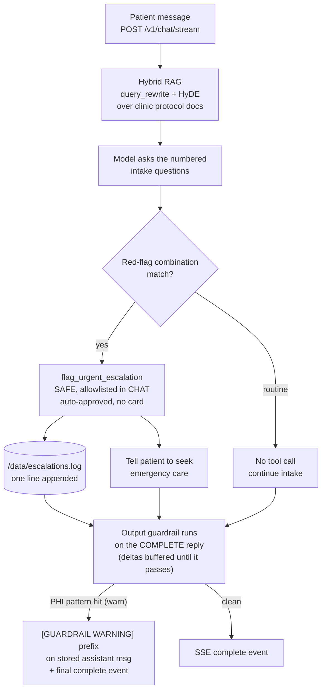

# Riverside Family Clinic -- Pre-Visit Patient Intake

A pre-visit intake chat that asks the clinic's own numbered questions, checks answers against the clinic's
own triage protocol, silently escalates a red-flag combination -- and never writes to a patient's chart on
its own. Human judgment still enters, just through a line in a nurse's review queue instead of a mid-chat
approval card.

> **Not a real clinic. Not medical advice.** Riverside Family Clinic is fictional. The protocol documents
> under `data/seed/` are illustrative content written for this demo, not clinical guidance. See
> [Caveats / what's real vs. demo](#caveats--whats-real-vs-demo).

Runnable build for [`docs/04-healthcare-patient-intake.md`](../docs/04-healthcare-patient-intake.md). Reads
on top of [`docs/00-consuming-koboi-server.md`](../docs/00-consuming-koboi-server.md), the shared contract
every app in this repo builds on.

> Try it in one command: `curl -fsSL https://raw.githubusercontent.com/hedypamungkas/koboi-projects/main/quickstart.sh | bash`
> (or `bash quickstart.sh --project healthcare-intake` from a checkout). Then jump to [Run it](#run-it).

## What this app does

A patient opens a web chat before their appointment. The assistant walks them through the clinic's intake
questions, grounds every reply in Riverside's own protocol documents via RAG, and if the symptoms match a
red-flag combination (chest pain plus shortness of breath, FAST stroke signs, suicidal ideation, and so on)
it calls one tool that appends a single line to a nurse's review log and tells the patient to seek
emergency care. Routine symptoms produce no tool call.

What it deliberately does **not** do: diagnose, suggest treatments or medications, write to any EHR, page
anyone, or touch the filesystem beyond that one log line. Safety here comes from what the agent *can't*
do, not from a gate on what it can.

## The scenario

Riverside Family Clinic runs four locations. Today a patient arrives, takes a clipboard in the waiting
room, and writes down their symptom history by hand while the visit slot burns down. A nurse glances at it
seconds before the doctor walks in. The red-flag combinations the clinic actually wants caught -- chest
pain with shortness of breath, sudden one-sided weakness with slurred speech -- live in a protocol document
the clipboard never cross-references in real time.

The clinic wants the same intake to happen online, before the visit, in the patient's own words -- with the
assistant checking each answer against the clinic's own protocol and flagging only the combinations
Riverside's own clinical staff wrote down. The doctor then sees a clean summary; the nurse sees the urgent
ones first. Nobody rewrites the chart, and nobody on the software side wants to be the one who shipped a
bot that "almost" paged a doctor.

## How teams handle this today, and what they still lack

Most clinics handle pre-visit intake one of three ways. The EHR-embedded patient portal (MyChart-style
intake forms) is where the data lives and is the path of least resistance -- but the intake is a rigid form
that routes exactly where it was configured to route and stops bending the moment a symptom doesn't fit a
field; you can't drop in your own red-flag logic without a vendor change. A standalone rules engine gives
you that routing cleanly but freezes the moment a patient phrases a symptom in a way the rules don't
expect. A custom LLM app is flexible -- you point it at your protocol docs and it asks good questions --
but you're left rebuilding the same plumbing every project needs: the RAG chunking, the output guardrail
that stops a phone number leaking into a log, the read-only mode that lets the bot raise a flag without
handing it a filesystem, the audit trail, the session handling.

The honest gap: existing approaches make you choose between fast-to-start and fully-yours. The portal is
fast but you can't extend it; the custom app is yours but you rebuild the safety layer every time, and the
built-in secret filter every framework ships catches API keys and card numbers, not the phone numbers,
dates of birth, and insurance IDs that are the actual PHI in an intake conversation.

## Enter koboi-agent

[koboi-agent](https://github.com/hedypamungkas/koboi-agent) is an MIT-licensed, async-Python library and
self-hostable server for agents meant to run unattended. You describe the whole stack -- model, tools,
guardrails, RAG, sandbox, serving -- in one YAML file and run it. This app is the natural shape for the
gap above: koboi ships the RAG, the chat transport, the read-only mode, and the output-guardrail pipeline
built in, so you get a working intake in an afternoon; you keep the same codebase when the business needs
something custom -- here, one PHI-redaction guardrail and one escalation tool. Batteries-included *and*
extensible on the same code, not a choice between them.

## How this app solves it

### What you get for free

| koboi feature | The pain it removes |
|---|---|
| **`rag` (hybrid retriever, `query_rewrite: true`, `hyde: true`, `rerank: true`)** | Grounds every reply in Riverside's two seed docs (`red_flag_symptoms.md`, `intake_questions.md`) instead of the model's general medical knowledge. `query_rewrite` and `hyde` reuse the **chat LLM client** (`koboi/rag/registry.py:486-489`), so a patient typing "sharp chest pain when I breathe" lifts the protocol even when the wording differs -- no new key. |
| **`rag.rerank: true`** (heuristic, not a cross-encoder) | Reranks retrieved chunks by keyword overlap. Honest: this is the `RerankerRetriever` heuristic, **not** a real cross-encoder -- a dict here would select jina/cohere/local and need its own key. |
| **`rag.embedding_cache_path: /data/rag_embedding_cache.json`** | A container restart does not re-embed the seed protocol docs. Verified: the cache file is written on first run. |
| **`embedding:` (dedicated provider)** | Decouples the embedding client from the chat gateway, which doesn't serve embeddings. Without it, hybrid retrieval falls back to keyword-only. |
| **`context.strategy: smart_truncation`, `keep_last: 20`** | Patients name their chief complaint in the **first** message, then spend the rest of the chat answering follow-ups. `smart_truncation` keeps the system prompt and the literal first user message verbatim, so the one message you can't afford to lose isn't the first thing trimmed. |
| **`agent.mode: chat` + top-level `mode.read_only_tools: [flag_urgent_escalation]`** | `chat` is the correct mode for a live, read-only patient conversation. koboi 0.18+ added the `mode.read_only_tools` escape hatch (`koboi/hooks/registry.py` -> `ModeHook(extra_read_only=...)`) so a SAFE custom tool actually runs in CHAT. Pre-0.18 there was no hatch, and this app had to run `mode: act` as a workaround (see [Caveats](#caveats--whats-real-vs-demo)). |
| **`server` (chat transport + CORS)** | SSE chat, session handling, and `X-Session-Id` replay for multi-turn conversations are built in. CORS is locked to `http://localhost:3004` with `expose_headers: [X-Session-Id]`. |
| **Output-guardrail pipeline (built-in secret patterns)** | koboi's built-in `OutputGuardrail.PATTERNS` catches API keys, passwords, and card numbers. In this app those patterns are folded into the single `PHIRedactionGuardrail` (see below) rather than run as a separate YAML-only instance -- one dict-shaped `guardrails.output` slot, both responsibilities. |

### What you build

| Piece | What it does | Risk / gate |
|---|---|---|
| `flag_urgent_escalation` tool (`src/healthcare_ext/tools.py`) | The **only** tool. Appends one line to `/data/escalations.log`. No EHR write, no filesystem or shell access, nothing else. | `SAFE` -- auto-approved, no `pending_approval` card, allowlisted into CHAT via `mode.read_only_tools`. |
| `PHIRedactionGuardrail` (`src/healthcare_ext/guardrails.py`) | Flags phone numbers, dates of birth, and insurance-ID-looking strings that the built-in secret filter doesn't catch. Subclasses `PatternGuardrail`. | Registered as `phi_redaction` via a `koboi.guardrails` entry point in `pyproject.toml`, with a belt-and-suspenders direct `register()` call in `healthcare_ext/__init__.py`. |
| `data/seed/*.md` | The two fictional protocol docs loaded into RAG. | Clinic-owned content in a real deployment. |
| `frontend/` | Plain HTML/JS patient chat, no build step, talking to `/v1/chat/stream` over SSE. | -- |

The load-bearing design choice: `guardrails.output` is a **single dict-shaped slot** (a list fails pydantic
validation -- `GuardrailsConfig.output` is one `OutputGuardrailConfig`, verified against
`koboi/config_models.py`). So `{name: phi_redaction, detect_sensitive: true}` builds **only**
`PHIRedactionGuardrail`, which folds in the built-in `OutputGuardrail.PATTERNS` (the secret-leak patterns)
when `detect_sensitive: true`. One guardrail instance, both responsibilities -- you don't lose secret
detection by swapping in the PHI filter.

## The flow



Two things the diagram is honest about. First, the escalation is **silent on the wire**: a SAFE tool
allowlisted into CHAT auto-approves, so there is no `pending_approval` event -- the patient just sees the
"seek emergency care" message, and the nurse's log gets the line. Second, because this app configures an
output guardrail, koboi 0.18+ **buffers** the streamed tokens (`should_buffer =
bool(self.output_guardrails)` in `koboi/loop.py`) and only flushes them to the browser AFTER the output
guardrail runs on the complete response. The guardrail therefore *does* gate the stream (a
`block`/`deny`/`abort` result discards the buffer entirely; those tokens never reach the wire). PHI still
leaks in this app not because of timing but because a `warn` result only prepends a banner -- see the
streaming caveat below.

## Run it

Fastest path (macOS / Linux, Docker required):

```sh
curl -fsSL https://raw.githubusercontent.com/hedypamungkas/koboi-projects/main/quickstart.sh | bash
# from a checkout:  bash quickstart.sh --project healthcare-intake
```

Manual path:

```bash
cd healthcare-intake
cp .env.example .env          # fill in OPENAI_API_KEY (+ EMBEDDING_* if your gateway needs it)
docker compose build
docker compose up -d
sleep 3
curl -sf http://localhost:8004/healthz    # -> {"status":"ok"}
curl -sf http://localhost:8004/readyz     # -> {"status":"ok","checks":[...]}
```

- Backend: `http://localhost:8004` -- Frontend (patient chat): `http://localhost:3004`

### Smoke test

**Routine symptom** -- expect a grounded intake, no tool call, no log file:

```bash
curl -s -N -X POST http://localhost:8004/v1/chat/stream -H "Content-Type: application/json" \
  -d '{"message": "I have had a fever and cough for 3 days"}'

docker compose exec koboi cat /data/escalations.log   # -> No such file or directory
```

The reply asks the exact numbered questions from `intake_questions.md` and reasons "does not by itself
match an urgent escalation pattern" using `red_flag_symptoms.md`'s own vocabulary. `tools_used: []`, stream
ends in a `complete` event, and `escalations.log` is never created because `flag_urgent_escalation` never
ran.

**Red-flag symptom** -- expect a silent escalation:

```bash
curl -s -N -X POST http://localhost:8004/v1/chat/stream -H "Content-Type: application/json" \
  -d '{"message": "crushing chest pain and I cannot catch my breath, it started 10 minutes ago"}'

docker compose exec koboi cat /data/escalations.log
# -> Chest pain with shortness of breath for 10 minutes
```

A `tool_call` for `flag_urgent_escalation` with `reason: "Chest pain with shortness of breath for 10
minutes"`, `tool_result: "Flagged for clinician review."`, **no** `pending_approval` event (silent, per
the design doc), and the `complete` content tells the patient to call emergency services.

**PHI guardrail** -- ask the assistant to repeat a phone number; the stored reply gets a warning prefix:

```bash
curl -s -N -X POST http://localhost:8004/v1/chat/stream -H "Content-Type: application/json" \
  -d '{"message": "Please confirm my number is 555-982-1234 back to me"}'
# -> complete content: [GUARDRAIL WARNING (PHIRedactionGuardrail): Possible phone number]\n\n555-982-1234
```

The guardrail fires on model output as designed. Note the phone number is still visible -- see the
streaming caveat below: a `warn` prepends a banner but does not redact, and `sanitized_content` is not
consumed on the warn path.

## Caveats / what's real vs. demo

In 2026 this section *is* the marketing -- it's the proof the app was actually run, not just written.
Every item below was checked against koboi 0.18.2 source or a live run.

- **Not a real clinic, not medical advice.** Seed docs are fictional and illustrative. A real deployment
  would have Riverside's own clinical staff author and maintain `data/seed/*.md`.

- **Streaming caveat (load-bearing).** `AgentCore.run_stream` (`koboi/loop.py`) produces `TextDeltaEvent`s
  as the LLM generates. koboi 0.18+ (`G8b`) sets `should_buffer = bool(self.output_guardrails)`: when an
  output guardrail is configured -- as it is here (`phi_redaction`) -- those deltas are **buffered** and
  are only flushed to the browser AFTER `_process_output` runs on the complete response. So the guardrail
  genuinely gates the stream -- a `block`/`deny`/`abort` result discards the whole buffer and the blocked
  tokens never reach the wire; a `warn` lets the buffer through. The reason a phone number still leaks in
  this app is **not** timing but action: a `warn` result only prepends a `[GUARDRAIL WARNING ...]` banner
  to the stored assistant message and the final `complete` event's `content`; it does not redact, and the
  flushed `text_delta`s carry the raw number. The phone number is therefore still visible in both the
  flushed deltas and the complete content. (With *no* output guardrail configured, koboi streams live
  token-by-token with no buffering -- not the case here.)

- **`sanitized_content` is populated but not consumed on the `warn` path.** `_process_output`
  (`koboi/loop.py`) branches on `action`: `block`/`deny`/`abort` raises; `abstain` swaps the output for
  `GuardrailResult.sanitized_content` (used by grounding guardrails, not this one); any other action
  (incl. `warn`) just prepends a `[GUARDRAIL WARNING ...]` banner and continues. `PHIRedactionGuardrail`
  uses `DEFAULT_ACTION = "warn"`, so its `sanitized_content` (a regex-redacted copy) is computed and then
  ignored -- the phone number stays in the flushed deltas and the complete content. Same is true of the
  built-in `OutputGuardrail`, which also defaults to `warn`.

- **No clinician summary view.** The design doc's second, internal page (a nurse reads
  `/data/escalations.log`) was scoped out; only the patient chat is built. Nothing prevents adding a
  second static page that reads the same log.

- **Tracing is intentionally off** (no `tracing:` block). Free-text symptom answers can carry PHI a regex
  won't catch, so this deployment ships with tracing off rather than trying to scope it down after the
  fact.

- **The `koboi-data` volume is unencrypted** and holds conversation history -- which for this app is
  patient health information. Encryption and access control are the operator's job, not something koboi or
  this app does.

- **`server.auth_required: false` is local-only** -- every use case in this repo ships this way for the
  smoke-test POC. Production flips it to `true` and mints a token with `docker compose run --rm koboi
  koboi keys create --label prod`.

### Deviations from the design doc

A few specifics in [`docs/04`](../docs/04-healthcare-patient-intake.md) don't match what
`koboi/config_models.py` actually validates or what the running server does. Each was checked against
source before writing `config/agent.yaml`:

1. **`rag.corpus_path` does not exist** in `RagConfig`. `docs/04`'s `rag.corpus_path: ./data/seed` would
   silently load zero documents (extra keys are ignored, not errored). The config lists both seed files
   explicitly under `rag.documents`, which is the real field.

2. **`guardrails.output` cannot be a list.** `docs/04` shows `guardrails.output: [phi_redaction]`, but
   `GuardrailsConfig.output` is a single `OutputGuardrailConfig`. Verified empirically: passing a list
   raises `pydantic.ValidationError` and `Config.from_yaml()` re-raises it as `ValueError` -- the server
   would fail to start. Fixed to the dict form `{name: phi_redaction, detect_sensitive: true}`.

3. **`BaseGuardrail.check()` gained a `context` kwarg in 0.18+.** Surfaced by a real end-to-end test after
   the 0.18.2 bump: the output pipeline now passes `context` (the retrieved RAG chunk strings) as a
   keyword arg. Our override was `async def check(self, content)` -- so every reply ended the SSE stream
   with `{"type":"error","error":"PHIRedactionGuardrail.check() got an unexpected keyword argument
   'context'"}`. Fixed by widening the signature to `check(self, content, context=None)` (the guardrail
   redacts the model's *output*, so `context` is accepted but unused). Any custom `PatternGuardrail` /
   `BaseGuardrail` subclass overriding `check()` needs the same fix on 0.18+.

4. **`agent.mode: chat` + `mode.read_only_tools` (resolved in 0.18+).** `docs/04` specifies `mode: chat`.
   Built originally against koboi 0.4.0, chat mode could not run `flag_urgent_escalation` at all: a clear
   red-flag message produced `tool_result: "Error: CHAT mode: tool 'flag_urgent_escalation' is not
   allowed..."` -- the escalation silently never happened and `/data/escalations.log` stayed empty for a
   textbook emergency. Root cause: `koboi/hooks/mode_hook.py`'s `ModeHook` blocks every tool not on a
   hardcoded read-only allowlist in CHAT/PLAN, **regardless of `RiskLevel`**. At 0.4.0 there was
   no extension point, so the workaround was `agent.mode: act` (SAFE risk + auto-approve meant no HITL
   pause, so patient-facing behavior matched). **koboi 0.18+ resolved this:** the top-level
   `mode.read_only_tools` list extends `ModeHook`'s read-only set. We now run the originally-intended
   `agent.mode: chat` with `mode.read_only_tools: [flag_urgent_escalation]` and `server.allowed_modes:
   [chat, act]`. Tool-level behavior is identical (SAFE, auto-approved, no card), and the mode now
   correctly reflects a live read-only intake -- dropping the cosmetic ACT-mode system-prompt suffix
   ("you may modify files and run shell commands") that was untrue for this app.

5. **`server.cors` is required, not optional.** Neither the design doc nor `docs/00` includes a `cors:`
   block. `koboi/server/app.py` only adds `CORSMiddleware` when `server.cors` is explicitly present (a
   deliberate "no wildcard default"). Without it, the frontend (port 3004) calling the API (port 8004)
   fails CORS in the browser. Added `allow_origins: ["http://localhost:3004"]` and
   `expose_headers: ["X-Session-Id"]` (without the latter, the browser's CORS policy hides
   `X-Session-Id` from JS and multi-turn sessions silently break).

6. **`docs/00`'s `streamChat` snippet reads the wrong event field.** It reads `event.text` for
   `text_delta` events; the actual `TextDeltaEvent` (`koboi/events.py`) field is `content`.
   `frontend/app.js` uses `event.content`.

## E2E test (what was actually run, against real Docker + a real LLM)

Verified against `koboi-agent[api]==0.18.2` from PyPI (no git checkout, no vendored wheel). The three
smoke-test cases above -- routine symptom (no tool, no log file), red-flag symptom (silent escalation,
log line written), PHI guardrail (warning prefix on the stored reply) -- were run end-to-end against a
real LLM via the shared gateway. The red-flag run is what surfaced deviation #4 (it failed with a
mode-blocked error under the originally-specified `mode: chat` before the 0.18 `mode.read_only_tools`
fix). Frontend sanity: `curl -sf http://localhost:3004/` serves `index.html`; a CORS preflight check
(`Origin: http://localhost:3004`) confirmed both `access-control-allow-origin: http://localhost:3004` and
`access-control-expose-headers: X-Session-Id` are present on `/v1/chat/stream`.
