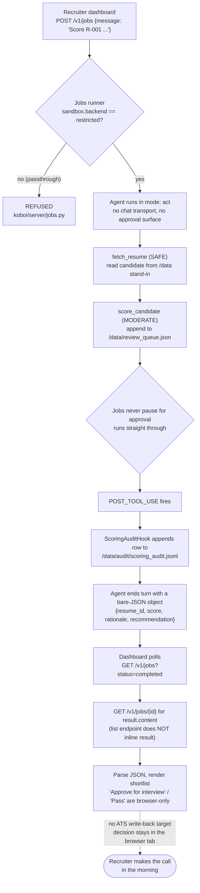

# Northstar Talent -- Overnight Resume Screening

> **Try it:** `curl -fsSL https://raw.githubusercontent.com/hedypamungkas/koboi-projects/main/quickstart.sh | bash` (pick `hr-screening`), or from a checkout: `bash quickstart.sh --project hr-screening --yes`. Dashboard on http://localhost:3002, API on http://localhost:8002.

An overnight resume screen that scores candidates against a requisition and writes a ranked shortlist -- and never rejects or advances anyone. A recruiter makes that call in the morning, with the agent's rationale attached.

## What this app does

A background job (`POST /v1/jobs`) that, given a `resume_id`, fetches the resume, scores fit against the requisition, writes a recommendation to a review queue, and appends every score to a durable audit log. It deliberately does **not** advance or reject a candidate, does **not** write to a real ATS, and does **not** pause for a mid-flow approval card -- there is no human awake at 3am to click one. Control comes from the advisory-only tool and the audit trail, not from an approval surface.

## The scenario

Northstar Talent is a fictional 40-person talent-acquisition firm that fills roughly 600 roles a year across engineering, product, and go-to-market. A senior backend requisition routinely draws 200+ applicants over a weekend. On Monday morning a recruiter burns the first three hours of the day triaging that intake -- skimming, sorting, drafting a one-line reason for each keep-or-pass so the hiring manager can defend the shortlist in a 10am sync.

The pain is not "we wish this was faster." The pain is the screen has to run **unattended overnight** (so the shortlist is ready at 9am, not noon), it has to leave an **auditable rationale** for every score (so a bias or compliance review has something to check), and **no automated system can be the one that rejects or advances a candidate** -- that is a human decision with legal weight. Most tools solve one of those. Few solve all three on the same codebase.

## How teams handle this today, and what they still lack

Recruiters triage high-volume intake one of three ways:

- **ATS-native keyword filters and knockout questions** (the screening layer in Workday, Greenhouse, Lever). Credit where it's due: they tie cleanly to the system of record and handle volume well. What they lack: brittle keyword logic that silently drops a strong candidate who phrased "Kafka" as "event streaming," and no rationale you can hand a hiring manager beyond "did not match keyword X."
- **Managed AI screening SaaS** (Eightfold, HireVue assessments, and the like). Honest strength: real ML ranking across large candidate pools. The friction: the score is a black box you cannot easily re-run, re-prompt, or audit per-criterion, you do not control the model or the rubric, and you are locked into their ATS integration.
- **A custom LLM script** (a notebook hitting the model API over a CSV of resumes). Fully yours and cheap to write. What it costs you: you rebuild the same plumbing on every project -- the unattended runner, resume-on-restart, the audit trail, the "recommend, don't reject" guardrail, the concurrency cap. By the time it is production-shaped, you have written a small framework.

## The gap

Most resume-screening options force a choice: a managed tool that scores but won't show its work, or a custom script that's fully yours but leaves you rebuilding the unattended runner, the audit trail, and the "recommend, don't reject" guardrail from scratch on every deploy.

## Enter koboi-agent

[`koboi-agent`](https://github.com/hedypamungkas/koboi-agent) is an MIT-licensed async-Python library and self-hostable server for agents that run unattended. This app is the natural shape for the gap above: you get a working overnight screen in an afternoon from the built-in jobs runner, the restricted sandbox, and a 20-line audit hook, and you keep the same codebase when the business needs a custom rubric or a real ATS write-back later. Batteries-included AND extensible on the same codebase, not one or the other.

## What you get for free / what you build

**Free (from the framework, config-only):**

- **`jobs` (autonomous batch)** runs the screen unattended via `POST /v1/jobs` so nobody has to be awake. `resume_on_startup: true` means a scoring run interrupted by a 3am container restart picks up where it left off instead of starting over. `max_concurrent: 5` + `timeout_seconds: 600` cap one night's blast radius. Jobs never pause for approval and never run in `yolo` -- the safety contract is built into the runner.
- **`sandbox.backend: restricted`** is **required** for a job to start at all -- `koboi/server/jobs.py` hard-refuses `passthrough` with `PermissionError: Autonomous jobs require sandbox.backend='restricted'`. `git_init: true` seeds each per-session workdir as a git repo so every overnight run leaves an auditable repo history of its working files. `rlimits` cap any sandboxed subprocess child.
- **`memory.backend: sqlite` + `db_path: /data/koboi_memory.db`** (in the mounted volume) is what gives `resume_on_startup` something to resume from -- without it the jobs/ownership sidecar DB lives inside the container's ephemeral filesystem and is lost when the container is recreated, so the resume flag points at nothing.
- **`agent.mode: act`** is the right level for an autonomous scoring run: it calls tools and writes advisory output, but commits nothing destructive. (Jobs reject `yolo` regardless of this setting.)
- **`server.cors.allow_origins: ["*"]`** lets the dashboard on `:3002` fetch the API on `:8002` cross-origin. koboi only registers `CORSMiddleware` when `server.cors` is a non-empty dict -- omit it and the browser blocks every request with no CORS headers present.

**You build (the `hr_ext` package, ~120 lines):**

- **`fetch_resume`** (`SAFE`, `src/hr_ext/tools.py`) -- reads a hardcoded candidate standing in for an ATS lookup. Auto-runs; read-only.
- **`score_candidate`** (`MODERATE`, advisory-only) -- takes `resume_id`, `score`, `rationale`, `recommendation` and appends a row to `/data/review_queue.json`. It is `MODERATE` because writing a file is non-trivial, and a `MODERATE` tool over chat transport would pause for a human approval -- **but jobs never pause for approval**, so it runs straight through. The control is the audit hook and the advisory-only write target, not an approval card.
- **`ScoringAuditHook`** (`src/hr_ext/hooks.py`) -- fires on `POST_TOOL_USE`, appends every `score_candidate` call to `/data/audit/scoring_audit.jsonl` so a bias/compliance review always has the full rationale to check. This is the load-bearing safety net for a job with no live human in the loop.

The system prompt in `config/agent.yaml` forces the agent to end its turn with a single bare-JSON object (`{resume_id, score, rationale, recommendation}`) so the dashboard can machine-parse the shortlist.

## The flow



## Run it

```bash
cd hr-screening
docker compose build
docker compose up -d
sleep 3

# Health + readiness
curl -sf http://localhost:8002/healthz
curl -sf http://localhost:8002/readyz

# Submit one scoring job
JOB=$(curl -s -X POST http://localhost:8002/v1/jobs -H "Content-Type: application/json" \
  -d '{"message": "Score resume R-001 against the Senior Backend Engineer requisition"}')
echo "$JOB"          # -> {"job_id":"...","status":"queued", ...}
JOB_ID=$(echo "$JOB" | python3 -c "import sys,json; print(json.load(sys.stdin)['job_id'])")

# Poll until completed
for i in $(seq 1 20); do
  STATUS=$(curl -s http://localhost:8002/v1/jobs/$JOB_ID)
  echo "$STATUS"
  echo "$STATUS" | grep -q '"status":"completed"' && break
  sleep 2
done

# Read the final assistant message (the bare-JSON shortlist row)
curl -s http://localhost:8002/v1/jobs/$JOB_ID | python3 -m json.tool

# Confirm the audit hook fired
docker compose run --rm koboi cat /data/audit/scoring_audit.jsonl
```

Expected `result.content` for `R-001` (Amara Fitri, strong backend fit) looks like a bare JSON object -- something like `{"resume_id": "R-001", "score": 88, "rationale": "...", "recommendation": "strong_match"}` -- which `frontend/app.js` parses and renders as a shortlist row. The audit log line mirrors the same fields plus `logged_at` and `tool_result`.

Then open **http://localhost:3002** for the recruiter dashboard. Submit any of `R-001` .. `R-004` and watch the row appear once the job finishes:

| `resume_id` | Candidate | Profile | Expected band |
|---|---|---|---|
| `R-001` | Amara Fitri | 8y backend, Python/FastAPI payments at scale, mentoring | strong_match |
| `R-002` | Bram Setiawan | 2y frontend React/TS, no backend | weak_match |
| `R-003` | Chandra Wijaya | 5y backend Java/Go, adjacent but no prod Python | possible_match |
| `R-004` | Dewi Anggraini | 10y eng leadership, non-hands-on last 3y | possible_match / weak_match |

## Caveats / what's real vs. demo

This is the part that proves the page was actually run. Every item below was verified against the installed `koboi-agent[api]==0.18.2` wheel and a live job submission.

- **`server.auth_required: false` is local-only.** Production flips this to `true` and mints keys with `koboi keys create`; the dashboard sends them as `Authorization: Bearer <token>`. All ten use-case configs in this repo ship `false` for local smoke-test POCs.
- **No real ATS.** `score_candidate` writes to `/data/review_queue.json`, not a real applicant-tracking system. The "Approve for interview" / "Pass" buttons in the dashboard are browser-only -- they mark a row's decision in that tab; nothing is persisted server-side and no write-back target exists. A real deployment would POST the decision back to the ATS.
- **`sandbox.rlimits` are defense-in-depth only.** `fetch_resume` and `score_candidate` are plain Python that run in-process -- no subprocess, no shell -- so the `cpu`/`as_mb`/`fsize_mb`/`nofile` caps have no current effect on them. They get real teeth the day you add a shell or code-exec tool to the agent.
- **`GET /v1/jobs?status=completed` does NOT inline the result.** Verified against the installed `koboi/server/app.py::list_jobs` -- it returns only `{job_id, status, session_id}`. The dashboard must do a second `GET /v1/jobs/{job_id}` to pull `result.content`. (`docs/02`'s pseudo-code was wrong about this; `frontend/app.js` does the second fetch.)
- **`ctx.tool_arguments` is a JSON STRING, not a dict.** Verified against `koboi.hooks.chain.HookContext` (`tool_arguments: str | None`) -- the raw JSON string the LLM produced for the call. `ScoringAuditHook.execute` does `json.loads(ctx.tool_arguments)` before reading any field; a naive `ctx.tool_arguments["resume_id"]` (as `docs/02`'s sample hook implied) raises `TypeError`.
- **`extra_hooks` rejects a bare `Hook` instance.** There is **no YAML key for hooks** -- `koboi serve <config>` exposes no hook entry-point (only `tools.custom` / `rag.custom_modules` / `context.custom_modules`). The only way in is `koboi.server.app.create_app(cfg, extra_hooks=[...])`, which is why `src/hr_ext/entrypoint.py` builds the `Config`, calls `create_app`, and runs `uvicorn` itself instead of using the bare CLI. And each `extra_hooks` entry must be a bare callable or a `(callback, events)` tuple -- passing `ScoringAuditHook()` (a `Hook` ABC subclass instance) crashes the first request with `TypeError: 'ScoringAuditHook' object is not subscriptable`. `entrypoint.py` builds that tuple itself -- `(hook.execute, hook.handles())` -- so the hook still fires only on `POST_TOOL_USE` as declared.
- **`memory.db_path` was added beyond the doc snippet.** Pointing it at `/data/koboi_memory.db` (the mounted volume) is what makes `jobs.resume_on_startup` actually survive a restart; without it the sidecar DB falls back to a path inside the container's ephemeral filesystem and is lost when the container is recreated, so `resume_on_startup` has nothing to resume from.

## Layout

```
hr-screening/
  config/agent.yaml        # act mode, jobs enabled, restricted sandbox + git_init + rlimits, CORS, no auth (local POC)
  src/hr_ext/
    tools.py               # fetch_resume (SAFE), score_candidate (MODERATE, advisory)
    hooks.py               # ScoringAuditHook -- POST_TOOL_USE audit append
    entrypoint.py          # create_app(cfg, extra_hooks=[...]) + uvicorn (hooks have no YAML key)
  backend/Dockerfile       # koboi-agent[api]==0.18.2 + hr_ext; installs git for sandbox.git_init
  frontend/                # recruiter dashboard: submit resume_id, poll jobs, render shortlist (vanilla JS)
  docker-compose.yml       # koboi on :8002 (volume /data), web on :3002
```

Design doc: [`docs/02-hr-recruiting-screening.md`](../docs/02-hr-recruiting-screening.md). Shared contract every app builds on: [`docs/00-consuming-koboi-server.md`](../docs/00-consuming-koboi-server.md).