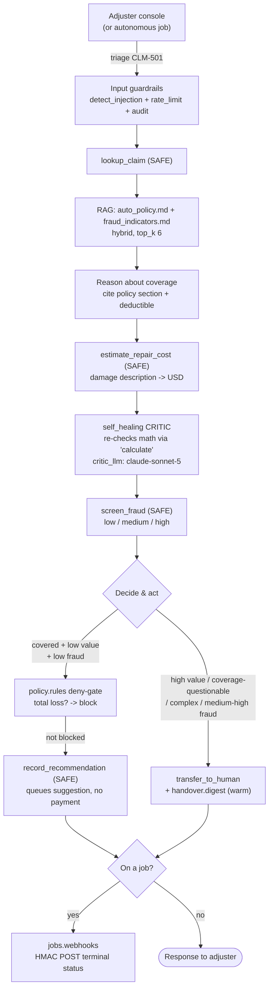

# Beacon Mutual -- a P&C FNOL triage that never pays a claim

> **Try it:** `curl -fsSL https://raw.githubusercontent.com/hedypamungkas/koboi-projects/main/quickstart.sh | bash` (then pick *insurance-claims*), or `bash quickstart.sh --project insurance-claims --yes` if you already have an OpenAI key. Backend lands on `http://localhost:8007`, adjuster console on `http://localhost:3007`.

A first-notice-of-loss triage that classifies a claim, checks it against the policy, estimates the damage, screens it for fraud, and routes it -- and never pays a claim on its own. Human judgment still enters, just through a warm hand-off to an adjuster instead of a mid-flow approval card.

This is the runnable build of [`docs/07-insurance-claims-triage.md`](../docs/07-insurance-claims-triage.md) for Beacon Mutual, a fictional property & casualty carrier. Read [`docs/00-consuming-koboi-server.md`](../docs/00-consuming-koboi-server.md) first for the shared contract every app in this repo builds on.

## What this app does

One agent that takes a claim id, works the triage, and either **queues a settlement recommendation** (for the routine, low-value, clearly-covered, low-fraud path) or **warms-hands the claim to a human adjuster** (for anything high-value, coverage-questionable, complex, or fraud-flagged). It deliberately does not move money, issue payments, or open a settlement approval surface -- the most it ever does is append a suggestion to a recommendations log for an adjuster to act on. That boundary is the whole point: it clears the routine path for humans without touching the part where a carrier's money and license are on the line.

## The scenario

Beacon Mutual is a mid-size fictional P&C carrier. FNOL auto claims land around the clock -- rear-enders at 2 a.m., a single-vehicle guardrail hit, a cracked windshield from road debris, a door dented in a parking lot. Every one of them needs the same fast, consistent first pass: is the loss covered, roughly what is the repair, are there fraud signals, and -- the decision that actually matters -- does this go to a routine settlement recommendation or to a human adjuster?

Human adjusters cannot eyeball every claim, and the routine ones are the ones eating their day. A cracked windshield under comprehensive coverage with a $250 deductible is not where an adjuster's judgment adds value; a frame-buckled total loss is. The bottleneck is the triage, not the settlement.

## Sizing the problem (one number, with a caveat)

Manual claims handling is where P&C carriers spend most of their loss-adjustment expense -- a commonly cited industry band is on the order of **9-11% of premiums earned** (Insurance Information Institute / industry aggregates on [iii.org](https://www.iii.org)). Relevance note: that figure is the carrier-wide LAE ratio, not auto-FNOL-specific, and we have not re-verified the latest year here -- treat it as a directional sizing anchor and confirm the current number on iii.org if it is load-bearing for you. The point it carries is narrower and uncontroversial: routine intake is a real, recurring cost center, which is exactly the band this demo triages.

## How teams handle this today, and what they still lack

Most teams handle first-notice triage one of two ways:

- **A rules engine or core-system workflow** (the kind baked into a claims platform). It routes cleanly and audits well, but it freezes the moment a claim does not fit a template -- a novel damage description or a soft fraud signal just falls out the bottom into a manual queue.
- **A custom LLM app** glued onto the claims system. Flexible, and it can read a free-text FNOL, but it leaves you rebuilding the same plumbing on every deploy: the input-injection guard, the rate limit, the human-handoff path, the audit trail, the retry-on-flaky-tool behavior, the "do not auto-settle a total loss" control gate.

The honest gap is a category-level one, not a knock on either path: **the rules engine gets you consistency but stops bending at the edges, and the raw-SDK app bends any way you like but makes you rebuild the guardrails, the handoff, and the audit trail from scratch every project.**

## Enter koboi-agent

[`koboi-agent`](https://github.com/hedypamungkas/koboi-agent) is an MIT-licensed, async-Python library and self-hostable server for agents meant to run unattended. You describe the whole stack -- model, tools, guardrails, RAG, sandbox, serving, jobs -- in one YAML file and run it. This app is the natural shape for the gap above: you ship the built-in triage in an afternoon, then keep the same codebase when the business needs a custom tool, hook, or policy rule. The bet is batteries-included *and* extensible on the same codebase -- not a choice between the two.

## What you get for free vs. what you build

Every feature below is wired in [`config/agent.yaml`](config/agent.yaml). The split matches the repo's own convention: built-in is YAML, custom is a small Python package.

**Built in (YAML) -- and the specific pain it removes:**

- **`self_healing` (`tool_error` retry + `fail_soft` + `graceful_max_iter`)** -- retries a flaky `estimate_repair_cost` or `lookup_claim` on `tool_error` (trigger `repeat_threshold: 2`), then degrades gracefully instead of looping forever. A transient tool error does not dead-end the claim.
- **`self_healing.tool_verification` (P4 CRITIC via the built-in `calculate` tool, `max_claims: 5`)** -- re-checks the damage-estimate arithmetic, so the number the adjuster sees has been double-checked, not just re-stated by the same model that produced it.
- **`self_healing.critic_llm: critic` + `providers.critic`** -- routes the CRITIC to a distinct named provider pointed at a *stronger* model (default `claude-sonnet-5` via `${CRITIC_MODEL}`), so the verifier is decoupled from the generator. `providers.critic` is its own provider block (`api_key` + `base_url`), so it can point at a different endpoint or key than the main client -- you are not forced to reuse the same gateway. Resolved fail-soft at `koboi/facade.py:1454` (warns and reuses the main client if the build fails).
- **`tools.builtin: [transfer_to_human]`** -- the warm-handoff path; the agent hands a complex or fraud-flagged claim to an adjuster instead of forcing a recommendation.
- **`handover.detection` + `handover.digest`** -- when the agent routes to a human, the digest summarizes the session for the receiving adjuster (`detection.coverage_threshold: 0.5`), so the handoff lands with context, not a bare "please call me back."
- **`policy.rules` (`action: deny`)** -- hard-blocks `record_recommendation` when its `rationale` arg globs to `*total loss*`, forcing a total loss to `transfer_to_human` instead. `deny` needs no approval surface (unlike `confirm`).
- **`rag` (hybrid retriever, `top_k: 6`, `auto_policy.md` + `fraud_indicators.md`)** -- grounds coverage reasoning in the policy and the fraud screen in the SIU protocol, on the agent itself (the single-agent path consumes `rag.documents`).
- **`embedding` (dedicated provider) + `context.smart_truncation` (8000 tokens)** -- hybrid RAG needs embeddings; the chat gateway usually does not serve them, so they get their own endpoint.
- **`guardrails.input.detect_injection` + `rate_limit` (20/min) + `audit` (`/data/audit/claims.db`)** -- a prompt-injection guard, a per-client rate cap, and an audit DB so every turn is reconstructable later.
- **`jobs` (`resume_on_startup: true`, `timeout_seconds: 900`) + `jobs.webhooks`** -- the unattended FNOL triage batch runs without an operator, and on completion HMAC-signs (`X-Koboi-Signature`) a terminal-status callback (`completed` / `failed` / `timed_out`) to the core claims system URL.
- **`sandbox.backend: restricted`** -- required to start an autonomous job; inert for the plain-Python custom tools here (no subprocess/shell), but it satisfies the gate.

**Custom (`src/claims_ext/tools.py`) -- all `SAFE`, no money movement:**

- `lookup_claim` -- reads a claim record by id (the mock claim store).
- `estimate_repair_cost` -- a deterministic pseudo-estimate from the damage description (stable so the CRITIC re-check is meaningful).
- `screen_fraud` -- scores the claim `low` / `medium` / `high` against the fraud indicators.
- `record_recommendation` -- the *most* the agent ever does: appends a settlement suggestion to a recommendations log for an adjuster. No payment, no approval card.

There is no settlement approval surface on purpose. HITL approval lives in [`customer-success`](../customer-success/) (UC10), the use case built for it.

## The flow



The diagram also shows where the gates actually fire: input guardrails up front, the CRITIC re-check after the estimate, the `policy.rules` deny-gate on the recommendation path, and the handover digest on the routing path.

## Run it

**One-liner** (picks *insurance-claims* from the wizard, writes `.env`, builds, starts, prints the URL):

```bash
curl -fsSL https://raw.githubusercontent.com/hedypamungkas/koboi-projects/main/quickstart.sh | bash
# or, headless with a key already in hand:
OPENAI_API_KEY=sk-... bash quickstart.sh --project insurance-claims --yes
```

**Manual path** (from this directory):

```bash
cd insurance-claims
cp .env.example .env          # fill in OPENAI_* + EMBEDDING_*  (CRITIC_MODEL defaults to claude-sonnet-5)
docker compose build
docker compose up -d
```

Backend: `http://localhost:8007` -- Adjuster console: `http://localhost:3007`

### Smoke test

```bash
curl -sf http://localhost:8007/healthz

# routine path -> queues a recommendation
curl -s -N -X POST http://localhost:8007/v1/chat/stream -H "Content-Type: application/json" \
  -d '{"message":"Triage claim CLM-501 and route it.","mode":"act"}'

# total-loss path -> warm hand-off to an adjuster (no recommendation recorded)
curl -s -N -X POST http://localhost:8007/v1/chat/stream -H "Content-Type: application/json" \
  -d '{"message":"Triage claim CLM-502 and route it.","mode":"act"}'

# what the routine path actually wrote:
docker compose exec koboi cat /data/recommendations.jsonl
```

Expected: CLM-501 (rear-end collision, low value, low fraud) calls `lookup_claim` -> `estimate_repair_cost` (a low-value repair estimate) -> `screen_fraud` -> `record_recommendation`, citing collision coverage and the policy deductible. CLM-502 (frame buckled, total loss) lands in the total-loss estimate band and routes to `transfer_to_human` with a digest -- nothing is appended to `recommendations.jsonl`.

## Caveats / what is real vs. demo

This section is mandatory and unsweetened -- in 2026 it is the marketing. Every item below was found by running the app, not by reading the design doc.

- **The design-doc DAG does not work in 0.18.2.** The original sketch was a multi-agent DAG (`coverage_check` / `damage_estimate` / `fraud_screen` / `decide`). In koboi 0.18.2 the orchestrator's local sub-agent builder (`koboi/orchestration/orchestrator.py:478` -> `AgentFactory.create_agent`) only knows four hardcoded demo agents (`hr` / `sales` / `finance` / `general`) and falls back to `general` for any other name. The config-aware builder (`factory.py:_build_agent_from_def`) is defined but has zero callers, so `orchestration.agents[].system_prompt` / `rag` / `tools` are **dead config** at runtime -- every DAG node would run as the generic `general` agent with no tools and no per-node RAG. A live DAG run confirmed it: nodes stated intent ("I'll look up CLM-501") but emitted `tool_calls: null`. So this app is single-agent, where the custom tools, RAG, self-healing, handover, and policy gates all genuinely fire. Orchestration is still showcased in this repo -- by [`market-intel`](../market-intel/)'s `deep_research` mode, which injects web tools into its research nodes via a separate code path. (Line numbers above are version-sensitive and were current at 0.18.2.)
- **`grounding_check` is intentionally not used here.** This triage is tool-driven -- the load-bearing facts (claim record, repair estimate, fraud screen) come from tool *results*, not retrieved RAG chunks. `grounding_check` judges faithfulness to retrieved context, so a correct tool-sourced answer scored ~0.08 and abstained, which both misfired and triggered a self-healing retry loop (confirmed live). The policy/fraud RAG is still retrieved for coverage reasoning; it is just not scored by a grounding guardrail. `grounding_check` fits RAG-Q&A apps (see [`customer-success`](../customer-success/), UC10), not this.
- **`policy.rules` is config-only in the live run.** Wired per `PolicyRuleConfig` (`argument_patterns` are per-arg globs) and evaluated in the tool pipeline; a claim whose `record_recommendation` rationale globs to `*total loss*` would be hard-denied. But in the verified CLM-502 run the agent routed to `transfer_to_human` on its own, so the deny-gate was never actually hit. Live-verify this if the deny-gate is load-bearing for you.
- **`record_recommendation` is `SAFE`; there is no settlement approval card and no money movement.** The most the agent does is queue a suggestion. Human judgment enters via `transfer_to_human`. HITL approval lives in UC10.
- **`self_healing.critic_llm` + `providers.critic` is verified wired** (CLM-501 still routes to `record_recommendation` with the critic on), but it was live-verified primarily on the routing outcome, not on inspecting every CRITIC turn.
- **Four fictional FNOL records** in `src/claims_ext/tools.py` (`CLM-501` .. `CLM-504`); no real claims system behind them.
- **`sandbox.backend: restricted` is inert** for the plain-Python custom tools here -- it only satisfies the autonomous-jobs gate.
- **`server.auth_required: false`** is local-only. Production flips this and mints keys via `koboi keys create`.

## Layout

```
insurance-claims/
  pyproject.toml           # installable claims_ext package (src/ layout)
  config/agent.yaml        # single agent: tools + RAG + self_healing + handover + policy + jobs.webhooks
  src/claims_ext/
    tools.py               # lookup_claim, estimate_repair_cost, screen_fraud, record_recommendation (all SAFE)
  data/seed/
    auto_policy.md         # coverage RAG (policy excerpt)
    fraud_indicators.md    # fraud RAG (SIU protocol)
  backend/Dockerfile       # koboi-agent[api]==0.18.2 + claims_ext; bare koboi serve
  frontend/                # adjuster console: FNOL queue + chat, vanilla JS, no build step
  docker-compose.yml
```

The frontend is plain HTML + vanilla JS. The left panel lists the four demo FNOL claims; clicking one pre-fills a triage question. The chat column pins `mode: "act"` and carries `X-Session-Id` across turns. CORS is required (`3007 != 8007`), so `config/agent.yaml` sets `server.cors.allow_origins: ["http://localhost:3007"]` + `expose_headers: ["X-Session-Id"]`.
