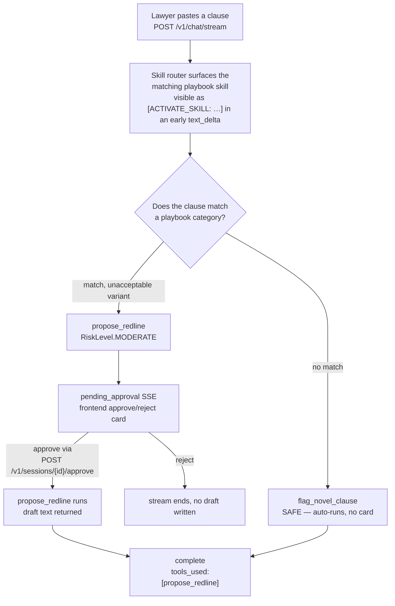

# Kessler & Vance — First-Pass Contract Redlining

> A first-pass contract reviewer that drafts redlines against the firm's clause playbook — and never sends, files, or signs anything.

Runnable build for [`docs/05-legal-contract-review.md`](../docs/05-legal-contract-review.md) (Kessler & Vance, a fictional law firm). Read that doc and [`docs/00-consuming-koboi-server.md`](../docs/00-consuming-koboi-server.md) first.

Try it now:

```bash
curl -fsSL https://raw.githubusercontent.com/hedypamungkas/koboi-projects/main/quickstart.sh | bash
# or, from inside a checkout:
bash quickstart.sh --project legal-contract-review
```

## What this app does

You paste a clause. koboi surfaces the matching playbook skill (`indemnification`, `limitation_of_liability`, `termination`), drafts a redline using the firm's approved fallback language, and pauses for a lawyer to click **approve** before the draft is even written. A clause with no playbook match gets flagged for a human instead of guessed at.

What it deliberately does **not** do: it never sends, files, or signs anything. Both tools return text that lands inside the current chat turn for a lawyer to read (for an unattended overnight job, outputs currently surface inline in the job output — see the open-question caveat below). The firm's own CLM/DMS still does the actual work — this just kills the repetitive first pass.

## The scenario

**Kessler & Vance** is a fictional ~60-lawyer commercial firm. The transactional team reviews a steady stream of vendor and customer contracts against a standard playbook: for each clause type, the language that's acceptable, the language that isn't, and a fallback the firm offers instead. Junior associates do most of this work — `indemnification`, `limitation of liability`, `termination` show up in almost every contract, and the playbooks for them change quarterly as the firm's risk position shifts.

The friction is that the playbook mostly lives in lawyers' heads and shared Word docs, not in any system. So the first pass over a routine contract eats hours of associate time before anyone knows whether the contract is routine or a problem. The partners want that first pass automated — flag what's risky, draft against the fallback, escalate what isn't recognized — without ever letting a draft leave the session unsupervised.

## One data point

Contracting inefficiency is a measurable cost on the demand side that pushes firms exactly like this one for faster turnaround: per the report, more than 50% of organizations surveyed say inefficiencies in their contracting processes have cost them business — EY Law and the Harvard Law School Center on the Legal Profession's *General Counsel Imperative* study ([ey.com](https://www.ey.com/en_gl/insights/law/the-general-counsel-imperative-how-does-contracting-complexity-hide-clear-profitability)). Relevance caveat: that's corporate in-house teams talking about their own contracting, not outside counsel specifically — but it's the same pressure (slow turnaround = lost deals) that makes a faster first-pass redliner worth building.

## How teams handle this today

- **CLM platforms with clause libraries and "AI redline"** (Ironclad, LinkSquares, Icertis, DocuSign CLM) are good at repository, workflow, and sign-off — but the playbook has to be re-encoded in each vendor's proprietary format, the redline model is a black box, and the moment your firm's risk position changes you're back in a config UI someone else owns.
- **Word track-changes plus macros and a shared playbook doc** is what most firms actually run on. It's flexible and every lawyer already knows it, but the playbook isn't enforced by anything, there's no audit trail of *why* a clause was changed, and the same associate re-derives the firm's position from memory on every contract.
- **A custom LLM script or Word add-in** is the shape most teams want, but it dumps the load-bearing plumbing on you: playbook retrieval, the approval-before-drafting gate, the audit trail, the chat-vs-overnight-job split. You rebuild it on every project, and the first time it silently drafts against a stale playbook entry, trust breaks.

## The gap

Most agent stacks force a choice: a low-code CLM "AI" gets you a button fast but stops bending at the firm's specific playbook rules and locks the playbook into a proprietary format; a raw LLM script is fully yours but you rebuild the same plumbing — playbook retrieval, the approval-before-drafting gate, the audit trail, the overnight batch — on every deploy.

## Enter koboi-agent

[koboi-agent](https://github.com/hedypamungkas/koboi-agent) is an MIT-licensed async-Python library and self-hostable server for agents that run unattended. Its **Skills** system is the natural shape for this gap: the playbook is just Markdown folders the firm edits directly, and koboi surfaces the right one to the model based on the clause being discussed — no retriever, no chunking, no embeddings. The approval-before-drafting gate is a single risk level on the tool. The honest bet: ship the built-in version this afternoon, and keep the same codebase when the firm wants to add a fourth clause type or swap in its own escalation hook.

## What you get for free / what you build

**What you get for free** — each koboi feature mapped to the pain it removes:

- **`skills` (`search_paths: [/app/playbook_skills]`, `budget_chars: 8000`)** — the playbook is pure Markdown `SKILL.md` files; koboi surfaces the right skill to the model based on the clause being discussed. No retriever code, no chunking, no embeddings. Skill `description`s use multiple word forms (`indemnification (indemnify, indemnifies)`) because `SkillRegistry.route` does exact word-set matching with **no stemming** — a clause phrased "Vendor shall indemnify…" wouldn't score against a description containing only `indemnification`.
- **`tools.builtin: [memory_store, memory_recall]`** — turn-to-turn chat memory, so "now what about 8.2?" carries context from the clause you just reviewed.
- **`memory.backend: sqlite` (`db_path: /data/koboi_memory.db`)** — persistent session memory across sessions.
- **`agent.mode: act`** — required, because `ModeHook` hard-blocks every custom tool in `CHAT`/`PLAN`, even the `SAFE` `flag_novel_clause`. This was a real live bug post-merge: chat mode silently denied both tools, and the approval-timeout on `propose_redline` masked it.
- **`jobs.enabled: true`** — an overnight `/v1/jobs` batch over incoming contracts (doc 05's architecture includes it; the chat e2e recipe here doesn't exercise it). Over jobs, `propose_redline` auto-runs — `AutonomousApprovalHandler` approves `SAFE` **and** `MODERATE`; only `DESTRUCTIVE` needs a Trust DB rule.
- **`server` (chat + jobs + CORS)** — the review workspace plus follow-up chat; `cors.allow_origins: ["*"]` and `cors.expose_headers: ["X-Session-Id"]` so the browser can read the session header cross-origin (without `expose_headers`, `CORSMiddleware` defaults to hiding it and the review panel and follow-up chat silently never share a session).

**What you build** (`src/legal_ext/tools.py`, ~50 lines):

| Tool | Risk level | Behavior | Sends/files/signs? |
|---|---|---|---|
| `propose_redline` | `MODERATE` — **approval-gated** | Drafts using the matching skill's fallback language; pauses for a lawyer click *before* the draft is written | No |
| `flag_novel_clause` | `SAFE` — **auto-runs** | Escalates anything with no playbook match; no card | No |

Both are draft/flag-only — neither writes anywhere outside the session.

## The flow



The approval gates the **drafting itself**, not just what happens after. A clause with no playbook match takes the left branch and never proposes contract language.

## Run it

```bash
curl -fsSL https://raw.githubusercontent.com/hedypamungkas/koboi-projects/main/quickstart.sh | bash
# or, from inside a checkout:
bash quickstart.sh --project legal-contract-review
```

Or build by hand:

```bash
cd legal-contract-review
cp .env.example .env   # fill in OPENAI_API_KEY (+ OPENAI_MODEL / OPENAI_BASE_URL if needed)
docker compose build
docker compose up -d --wait    # waits for the compose healthcheck (/healthz)
curl -sf http://localhost:8005/healthz
curl -sf http://localhost:8005/readyz
```

- Backend: `http://localhost:8005` · Frontend: `http://localhost:3005`

### Smoke test

```bash
# Unacceptable indemnification variant -> propose_redline (MODERATE) -> pending_approval.
# Stream pauses; grab X-Session-Id from the response header and approval_id from the event.
curl -s -N -X POST http://localhost:8005/v1/chat/stream \
  -H "Content-Type: application/json" \
  -d '{"message":"Review this clause: Vendor shall indemnify Client for any and all claims without limitation.","mode":"act"}'

# Resolve the approval so the stream resumes and propose_redline actually runs:
SID=<session-id-from-header>
curl -s -X POST http://localhost:8005/v1/sessions/$SID/approve \
  -H "Content-Type: application/json" \
  -d '{"approval_id":"<approval_id>","decision":"approve"}'

# No-match clause -> flag_novel_clause (SAFE, no card, no approval needed):
curl -s -N -X POST http://localhost:8005/v1/chat/stream \
  -H "Content-Type: application/json" \
  -d '{"message":"Review this clause: All disputes resolved via binding arbitration under the laws of the Moon.","mode":"act"}'
```

Expected on the first call: an early `text_delta` carrying `[ACTIVATE_SKILL: indemnification]`, then a `tool_call` for `propose_redline`, then a `pending_approval` event (because `propose_redline` is `MODERATE` and `AsyncCallbackApprovalHandler.should_approve` only auto-approves `SAFE`). After you POST the approval, the stream resumes and ends in `complete` with `"tools_used":["propose_redline"]`. The frontend at `:3005` handles the approve/reject card automatically (`frontend/app.js:renderApprovalCard`) — the manual `curl` above is only for API-only testing.

Bring it down with `docker compose down`.

## Layout

```
legal-contract-review/
  pyproject.toml            # legal_ext installable package (src/ layout)
  config/agent.yaml         # koboi config: skills, tools, server, jobs
  src/legal_ext/
    tools.py                # propose_redline (MODERATE), flag_novel_clause (SAFE)
  playbook_skills/          # the clause playbook — Markdown, no retriever code
    indemnification/SKILL.md
    limitation_of_liability/SKILL.md
    termination/SKILL.md
  backend/Dockerfile        # koboi-agent[api]==0.18.2 + legal_ext; bare `koboi serve`
  frontend/                 # clause review workspace + follow-up chat (nginx, static)
  docker-compose.yml
```

The frontend is plain HTML + vanilla JS, no build step. Left panel takes a pasted clause; the chat column runs `streamChat()` (doc 00 §3) with `X-Session-Id` carried across turns and `mode: "act"` pinned. CORS is required (`3005 ≠ 8005`).

## Honest caveats / what's real vs demo

This is the load-bearing section. The repo's voice is naming what doesn't work, and so is this.

- **The playbook covers 3 of doc 05's 5 categories** (`indemnification`, `limitation_of_liability`, `termination`). `ip_assignment` and `confidentiality` are called out in doc 05 but not built — adding them is a new `playbook_skills/<name>/SKILL.md` folder, not a deploy.
- **`propose_redline` DOES pause for approval**, contra doc 05's claim of "nothing to approve mid-run." `AsyncCallbackApprovalHandler.should_approve` only auto-approves `SAFE`; `MODERATE` and `DESTRUCTIVE` both prompt (`koboi/guardrails/approval.py`). The frontend leans into this as a "lawyer reviews everything" gate rather than routing around it — arguably a *better* fit for a redlining tool than doc 05's "no mid-run approval" claim.
- **`server.enabled` is cosmetic.** `koboi serve` doesn't gate on it — host/port come from CLI args (`koboi/cli.py:_run_serve`). Set `true` to match the other example configs; it changes nothing at runtime.
- **`skills.search_paths` is absolute (`/app/playbook_skills`)** to be unambiguous inside the container; doc 05's relative `./playbook_skills` is cwd-dependent. The `Dockerfile` `COPY`s the folder to that exact path.
- **Phantom `tool_call` event.** Occasionally the model activates a skill and calls `propose_redline` in one completion; the server emits a `tool_call` SSE with no follow-up `tool_result` / `pending_approval` / `error`. This is a koboi-agent core interaction between skill activation and a `MODERATE`+ tool call in the same completion, not a bug in this app's code. The model self-retries next iteration and that second call resolves normally — **the approval gate is never bypassed**; `propose_redline` still only runs after a lawyer clicks Approve. `frontend/app.js` handles it gracefully because its UI state is overwritten by the latest SSE event rather than keyed to a specific `tool_call_id`, so the orphaned `tool_call` never leaves a stale "drafting…" indicator.
- **`allowed-tools` / `disallowed-tools` in `SKILL.md` frontmatter are NOT enforced** by koboi today — they document intent to the model only. The actual control is `RiskLevel.MODERATE` on `propose_redline`.
- **`auth_required: false` is local-only** (every config in this repo ships that way for the smoke-test POC). Production must flip this to `true` and mint keys via `koboi keys create`; `app.js` has the `Authorization: Bearer …` plumbing behind an `AUTH_REQUIRED` flag.
- **Open question: where `flag_novel_clause` outputs land for an unattended overnight job.** koboi has no built-in notification mechanism — though `0.18+` adds `jobs.webhooks` (HMAC-signed terminal-status callbacks, used by UC7/8/10), which this app doesn't wire up. Today flags surface inline in the job output only.
- **`docs/00-consuming-koboi-server.md` is partly stale for the newer apps.** It still says "none of the apps wire up a webhook" — UC7/8/10 (three of the newer four) do. This app (UC5) doesn't.

## Production notes

- Flip `server.auth_required: true` and mint keys with `docker compose run --rm koboi koboi keys create --label prod`.
- Swap the implicit `sandbox.backend: passthrough` for `restricted` (per `configs/server_deploy.yaml` in the koboi-agent repo).
- Add the two remaining playbook categories (`ip_assignment`, `confidentiality`) as more `playbook_skills/<name>/SKILL.md` folders — no code change, no deploy.
- Wire an overnight `/v1/jobs` submission per incoming contract once the firm's CLM/DMS can push or poll for it (`jobs.enabled: true` is already set). Over jobs, `propose_redline` won't hang waiting on a human the way it does in chat — `AutonomousApprovalHandler` auto-approves `SAFE` and `MODERATE`.
