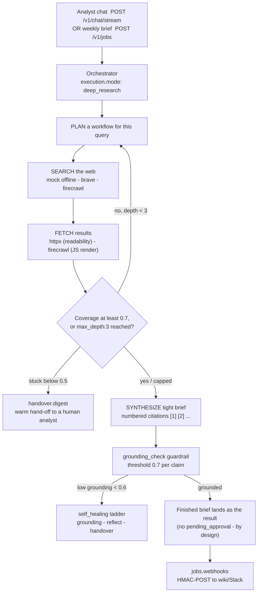

# Northwind Strategy — Cited Competitive-Intelligence Briefings

> A weekly brief that reads every tracked competitor's pricing, launches, earnings, hires, and regulatory moves across the live web — and refuses to write a sentence it can't cite.

Try it now (this wizard checks Docker, writes `.env`, builds, starts, prints the URL):

```bash
curl -fsSL https://raw.githubusercontent.com/hedypamungkas/koboi-projects/main/quickstart.sh | bash
# or, from inside a checkout:
bash quickstart.sh --project market-intel
```

Runnable build for [`docs/08-market-intelligence-briefing.md`](../docs/08-market-intelligence-briefing.md) (Northwind Strategy, fictional). Read that doc and [`docs/00-consuming-koboi-server.md`](../docs/00-consuming-koboi-server.md) first.

## What this app does

It produces **cited competitive briefs** on demand and on a schedule. You point it at a watchlist — three fictional competitors and five focus areas ship in the seed file — and koboi plans the research, searches the web, fetches sources, judges whether it has enough coverage, and writes a tight brief where every factual claim carries a numbered citation mapped to a sources list.

What it deliberately does **not** do: invent a fact. If coverage is thin, the brief says so and cites its lack of results rather than padding — verified live with the offline `mock` provider. It also ships **no custom Python package**. The whole thing runs off koboi's `deep_research` engine in one YAML file. That is the point of this use case: sometimes the built-in is the whole story.

## The scenario

**Northwind Strategy** is a fictional corporate-strategy firm. Every analyst owes each client a recurring read on a competitor set: pricing and packaging shifts, product launches, earnings, executive moves, certifications and regulatory actions. The cadence is weekly. The work is repetitive. And the worst failure mode in strategy work is an unsourced claim that collapses in a client meeting.

Three competitors on the watchlist, five focus areas, every cycle. No analyst team can re-run live web research across all of that every week without cutting corners — and the corners they cut are exactly the ones that surface in a Monday client read-out. (We did not find a clean primary source for how long competitive-intelligence work takes an analyst, so we are not quoting a figure; the pain is structural, not a benchmark.)

## How teams handle this today

Strategy teams patch this together from a few honest places:

- **Analyst newsletters and subscription intel services** (CB Insights, Gartner, Crayon, Klue) are good at structured, curated coverage — but they only see what their analysts saw last week, and they don't know your specific watchlist.
- **Manual Google plus a shared doc** is flexible and free, but the citations are whatever an analyst remembered to paste, and the work doesn't repeat itself — every Monday someone rebuilds it from zero.
- **A custom LLM script** is the shape most teams actually want, but it dumps the load-bearing plumbing on you: search, fetch, coverage checks, the hallucination guard, the audit trail, the scheduled run, the webhook to the wiki. You rebuild it on every project, and the first time it invents a competitor's pricing in a client deck, you pull it.

## The gap

Most agent stacks force a choice: a low-code intel builder gets you live fast but stops bending when you need a different coverage rule, a different model, or a custom hand-off; a raw SDK framework is fully yours but you rebuild the same research plumbing — search, fetch, the coverage gate, the hallucination guard, the scheduled run, the webhook — on every deploy.

## Enter koboi-agent

[koboi-agent](https://github.com/hedypamungkas/koboi-agent) is an MIT-licensed async-Python library and self-hostable server for agents that run unattended. Its `deep_research` orchestration mode is the natural shape for this gap: it plans a research workflow per query, searches and fetches the web, assesses coverage, drills deeper when needed, and synthesizes a cited brief — all from one YAML file. This app is the proof: there is no `src/` package, because the built-in is the whole story. The honest bet is that you ship the built-in version this afternoon, and you keep the same codebase when you need to bend it.

## What you get for free / what you build

**What you get for free** — each koboi feature mapped to the pain it removes:

- `orchestration.execution.mode: deep_research` — the only orchestration mode in this repo that genuinely injects `web_search`/`web_fetch` into research nodes (UC7's DAG does *not* work this way; see that README for the dead-config details). It plans the workflow per query so you don't hand-write a crawler.
- `research:` — `max_depth:3` coverage-gated re-plan rounds, `max_searches:40` / `max_fetches:50` caps, `coverage_threshold:0.7`, `citations: numbered` (`[1]`, `[2]` mapped to a sources list), and `persist_findings` dumps `/data/research_findings.jsonl` so a later run can reuse the corpus. Removes the "is this enough sources?" judgment call.
- `websearch:` — `search.provider` defaults to `mock` (offline-safe; still runs the full plan → search → fetch → synthesize → cite loop and the hallucination guard). Set `WEB_SEARCH_PROVIDER=brave|firecrawl` + a key for live research. `fetch.provider` defaults to `httpx` (readability); switch to `firecrawl` for JS-rendered pages.
- `guardrails.output: grounding_check` (`threshold:0.7`) — every claim in the brief must be grounded. With no sources found, the engine **says so and cites its lack of results** rather than fabricating (verified live with the mock provider). This is the control that earns the brief a place in a client deck.
- `self_healing` (`triggers.low_grounding.threshold:0.6`, `ladder: {}`, `fail_soft: true`, `graceful_max_iter: true`) — on low grounding the ladder escalates grounding → reflect → handover. Note this config sets only the triggers and the ladder; it does *not* set `critic_llm` / `self_consistency`.
- `handover` (`detection.coverage_threshold:0.5`, `digest.enabled: true`) — low coverage warm-hands the half-finished brief to a human analyst with a digest. This is how human judgment enters; it is *not* an approval card.
- `jobs` (`max_concurrent:3`, `timeout_seconds:1800`, `resume_on_startup: true`) + `jobs.webhooks` — the weekly brief runs as an autonomous job. Research is LLM-heavy so concurrency stays modest, and a full cited brief fans out many sequential LLM calls (several minutes). The webhook HMAC-signs (`X-Koboi-Signature`) and POSTs the finished brief to the wiki/Slack receiver.
- `sandbox.backend: restricted` + `workdir: /data/workspace` — required to start an autonomous job at all (koboi's jobs path refuses `passthrough`). Web tools are HTTP-only, so node behavior is unchanged; this just unblocks jobs and tightens workspace isolation.
- `llm.timeout:300` + `max_retries:3` + `agent.max_iterations:20` — planning and synthesis via a slow gateway can blow past the 120s default, and deep research fans out many nodes.

**What you build**: nothing. The watchlist ships in `data/seed/tracked_competitors.md` and is mirrored inline in the system prompt (so the engine sees it without any custom tool); the brief lands as the job result. There is no `tools.custom`, on purpose — see the caveats.

## The flow



Both chat and jobs route through the orchestrator, so no `pending_approval` is ever emitted. A research brief has no in-flow money action; human involvement is the low-coverage handover.

## Run it

```bash
curl -fsSL https://raw.githubusercontent.com/hedypamungkas/koboi-projects/main/quickstart.sh | bash
# or, from inside a checkout:
bash quickstart.sh --project market-intel
```

Or build by hand:

```bash
cd market-intel
cp .env.example .env   # fill in OPENAI_*; optionally WEB_SEARCH_PROVIDER=firecrawl + FIRECRAWL_API_KEY
docker compose build
docker compose up -d
```

- Backend: `http://localhost:8008` · Frontend: `http://localhost:3008`

### Smoke test

```bash
curl -sf http://localhost:8008/healthz

# Cited deep-research brief. Give it time — deep research is slow.
curl -s -N --max-time 300 -X POST http://localhost:8008/v1/chat/stream \
  -H "Content-Type: application/json" \
  -d '{"message":"Research Acme Cloud pricing and product launches this quarter with citations.","mode":"act"}'

# Autonomous weekly brief job:
JOB=$(curl -s -X POST http://localhost:8008/v1/jobs -H "Content-Type: application/json" \
  -d '{"message":"Run this week'\''s competitive brief across all tracked competitors; cite every claim.","mode":"act"}' \
  | python3 -c 'import sys,json;print(json.load(sys.stdin)["job_id"])')
curl -s -N "http://localhost:8008/v1/jobs/$JOB/stream"
```

Expected with the default `mock` provider: a brief that honestly reports "no public results found" with numbered citations — the engine refuses to fabricate. Flip to `firecrawl` for live research: a live run on 2026-07-18 did 31 searches + 32 fetches and gathered 5 sources, in several minutes.

## Layout

```
market-intel/
  config/agent.yaml                    # deep_research orchestration + websearch + research + self_healing + handover + jobs.webhooks (NO src/)
  data/seed/tracked_competitors.md     # watchlist + focus areas + brief format
  backend/Dockerfile                   # koboi-agent[api]==0.18.2 + config + data only (no package to install)
  frontend/                            # watchlist + chat + "Dispatch weekly brief" job button, vanilla JS
  docker-compose.yml
```

The frontend is plain HTML + vanilla JS, no build step. Left panel is the watchlist (clicking a chip pre-fills a research question); the chat runs `streamChat()` (doc 00 §3) with `X-Session-Id` and `mode: "act"`. The **Dispatch weekly brief** button submits `POST /v1/jobs` and tails `/v1/jobs/{id}/stream`. CORS is required (`3008` is not `8008`).

## Honest caveats / what's real vs demo

This is the load-bearing section. The repo's voice is naming what doesn't work, and so is this.

- **CONFIG-ONLY app — there is no custom Python package.** An earlier draft added `get_tracked_competitors` / `publish_brief` tools, but a live run showed `deep_research` only injects its own `web_search`/`web_fetch` into research nodes — top-level `tools.custom` are registered but never invoked by the engine, so they were dead code and were removed. The watchlist ships in `data/seed/tracked_competitors.md` and is mirrored inline in the system prompt; the brief lands as the job result (delivered via `jobs.webhooks`). This is the repo's "sometimes the built-in is the whole story" data point.
- **`mock` provider by default so the build runs offline.** It still exercises the full plan → search → fetch → synthesize → cite loop and the hallucination guard, but it produces "no public results found". Flip `WEB_SEARCH_PROVIDER=firecrawl|brave` + a key in `.env` for live research.
- **Deep research is slow.** A full cited brief fans out many sequential LLM calls; expect several minutes. The job timeout is `1800s`. The chat smoke test may need a generous `--max-time` (the example above sets 300s).
- **No approval card by design.** `orchestration.enabled: true` routes chat *and* jobs through the orchestrator, which returns a synthesized result and emits no `pending_approval`. A research brief has no in-flow money action; human involvement is the low-coverage `handover`.
- **The hallucination-resistance claim is verified live (2026-07-18).** With no sources found the engine refuses to fabricate and cites its lack of results. A live `firecrawl` run did real research: 31 searches + 32 fetches, 5 sources gathered.
- **`server.auth_required: false` is local-only** (every config in this repo ships that way for the smoke-test POC). Production must flip this to `true` and mint keys via `koboi keys create`.
- **`docs/00-consuming-koboi-server.md` is partly stale for this app.** It still says "none of the apps wire up a webhook" — UC7/8/9/10 (this one included) *do* wire up `jobs.webhooks`.
