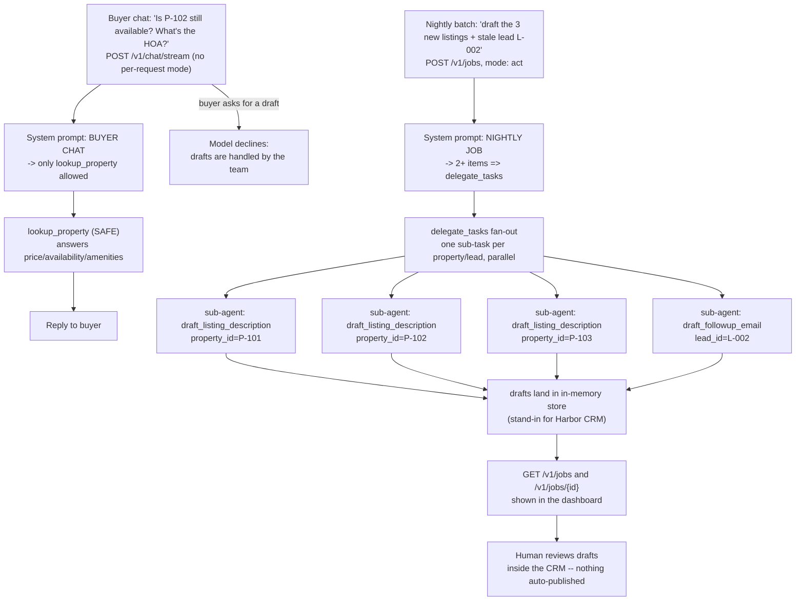

# Real Estate — Buyer Chat & Nightly Listing Drafts

> **Try it:** `bash quickstart.sh --project real-estate` — or, from inside the dir, `docker compose up -d --build`. Backend on `http://localhost:8006`, UI on `http://localhost:3006`. Needs Docker + an OpenAI/gateway key.

A buyer chat that answers property questions on the listings site all day, and the same agent that drafts listing descriptions and lead follow-up emails every night in parallel — and never publishes a listing or sends an email on its own.

## What this app does

It runs two very different jobs out of one koboi-agent config. By day, a buyer widget on the listings site calls `lookup_property` to answer price, availability, and amenity questions — and politely declines if a buyer asks it to draft copy. By night, an unattended batch drafts descriptions for new listings and follow-up emails for stale leads, fanning the work out in parallel via the built-in `delegate_tasks` tool.

It does not publish a listing, send an email, or push anything to the CRM. Drafts land in an in-memory store standing in for Harbor's CRM, and a human picks them up from there.

## The scenario

Harbor Realty Group (fictional) is a mid-size brokerage with agents juggling a steady roster of active listings and leads in the pipeline at any given time. Buyers hit the listings site all day asking the same handful of questions — price, beds/baths, availability, pets, parking. An agent rarely gets to all of them inside business hours, and the ones that go unanswered overnight are the ones that bounce to a competitor.

The other half of the work happens at night. Every morning a marketing coordinator opens the CRM, finds yesterday's new listings that still don't have descriptions, and writes the copy. Then she pulls the stale leads — last contacted weeks ago — and drafts each a follow-up email. On a busy day that's a steady stream of new listings plus a handful of stale leads, and the pass eats the first hour, gets done shallow, or gets skipped when showings pile up.

This demo ships four sample properties (`P-101`..`P-104`) — two for-sale condos/houses, one rental apartment, one townhouse, each with address, beds/baths, sqft, price, and a raw feature list the drafting tool turns into marketing copy. It also ships three leads (`L-001`..`L-003`); `L-002` (Marcus Webb) is deliberately stale (last contacted 2026-06-20) to exercise the follow-up path. They live in `src/realestate_ext/tools.py` as a mock store — there is no real CRM behind them.

## How teams handle this today

Listing CMSs (Yardi, AppFolio, generic MLS tooling) are the natural home for this work, and they're genuinely good at it: they own the listing graph, the lead pipeline, the showing calendar, and the source-of-truth data that nothing else should contradict. What they don't give you is a flexible, code-level reasoning surface over that data — a buyer-chat widget that reads a buyer's vague question and answers it in natural language using the *current* listing state, or a nightly batch that writes a fresh-sounding description from each listing's raw feature list rather than a mail-merge template.

The other path is a custom LLM app on top of your CMS data. It reasons well, but you rebuild the same plumbing on every project: the chat-vs-unattended-job split, the parallel fan-out for the nightly batch, the "do not draft inside a buyer chat" boundary, the resume-on-restart guarantee for the batch. And you ship it without a safety net.

## The gap

Listing software holds the data and routes leads cleanly but reasons shallowly at the edges; a custom LLM app reasons well but ships without the built-in fan-out, the chat/jobs split, or the per-caller behavior boundary — so you build both and rebuild the glue between them every time.

## Enter koboi-agent

[koboi-agent](https://github.com/hedypamungkas/koboi-agent) is a self-hostable, async-Python agent library (install `koboi-agent[api]==0.18.2` from PyPI). You describe the whole stack — model, tools, memory, sandbox, jobs — in one YAML, and run it as a CLI, a library, or a FastAPI server. This app is the natural shape for real estate: one config drives a live chat transport and an unattended jobs transport, the nightly fan-out is a built-in tool, and the "buyer chat never drafts" boundary lives in the system prompt rather than in a separate codebase. You get a working chat-plus-batch in an afternoon, and you keep the same codebase when you want to bend the drafting voice or swap in a real CRM.

## What you get for free

| Koboi feature | The pain it removes | Config (verified in `config/agent.yaml`) |
|---|---|---|
| **`tools.builtin: [delegate_tasks]`** | The nightly batch fans out N drafts in parallel, not sequentially. Each sub-task becomes its own sub-agent; results come back in one tool call. Listing `delegate_tasks` is also what *turns it on* — an empty/absent `tools.builtin` means **zero** builtin tools registered, this one included. | `tools.builtin: [delegate_tasks]` |
| **`jobs` (POST /v1/jobs)** | The nightly batch runs unattended, resumes on container restart, and has a wall-clock cap so a stalled fan-out can't hang forever. | `jobs.enabled: true`, `max_concurrent: 5`, `resume_on_startup: true`, `timeout_seconds: 1800` |
| **`sandbox.restricted` + `network: deny`** | Required for the job to start at all — `koboi/server/jobs.py` hard-refuses `passthrough` with `PermissionError`. Inert for our tools (none shell out or touch the filesystem), but the gate is blanket, not tool-aware. | `sandbox.backend: restricted`, `workdir: /data/workspace`, `network: deny` |
| **`agent.mode: act` + careful system prompt** | Required so the buyer widget's chat (which omits per-request mode) reaches `lookup_property`. `ModeHook` would block it in `chat` — the read-only allowlist has no way to know about custom tools. Safety here comes from risk level, not mode: the two draft tools stay `MODERATE` (never publish/send), not `DESTRUCTIVE`. | `agent.mode: act`, `server.allowed_modes: [chat, act]` |
| **`memory.sqlite`** | Persistent state shared by both paths. | `memory.backend: sqlite`, `db_path: /data/koboi_memory.db` |
| **`server` (chat + jobs + CORS)** | One config drives both transports. CORS exposes `X-Session-Id` so the buyer widget can auto-deny a stray `pending_approval` event cross-origin. | `server.auth_required: false` (POC), `cors.allow_origins: ["*"]` (POC), `cors.expose_headers: ["X-Session-Id"]`, `limits.max_iterations_cap: 15` |

## What you build

Three custom tools in `src/realestate_ext/tools.py` (loaded via `tools.custom: [{module: realestate_ext.tools}]`):

- `lookup_property` — **SAFE**. Reads price, availability, beds/baths, sqft, and features for a property by ID. The only tool a buyer chat is ever allowed to call.
- `draft_listing_description` — **MODERATE**. Turns a property's raw feature list into marketing copy and writes the draft to the in-memory store. Never publishes.
- `draft_followup_email` — **MODERATE**. Drafts a check-in email for a stale lead using that lead's history. Never sends.

The system prompt in `config/agent.yaml` hard-separates the two callers. **BUYER CHAT** may only call `lookup_property` — a draft tool call there has no human approver watching, so it would stall and then be auto-denied; if a buyer asks for a fresh description or a rewrite, the model explains drafts are handled by the team and offers to answer property questions instead. **NIGHTLY JOB** is the only context where the draft tools may be called, and for any batch of 2+ items the model must fan out via `delegate_tasks` — one sub-task per property/lead, each naming the exact tool and ID ("Call `draft_listing_description` with `property_id=P-101`"). `delegate_tasks` accepts at most 10 items per call, so a larger batch splits into multiple calls.

## The flow



Read the top half for the live buyer chat, the bottom half for the unattended nightly job. The two paths share one config and one set of tools; the system prompt is what keeps them from bleeding into each other.

## Run it

**One-liner** (from the repo root, or anywhere once published):

```bash
bash quickstart.sh --project real-estate
# or: curl -fsSL https://raw.githubusercontent.com/hedypamungkas/koboi-projects/main/quickstart.sh | bash
```

**Manual path:**

```bash
cd real-estate
cp .env.example .env          # fill OPENAI_API_KEY (and OPENAI_MODEL / OPENAI_BASE_URL if needed)
docker compose build
docker compose up -d
sleep 3
curl -sf http://localhost:8006/healthz
curl -sf http://localhost:8006/readyz
```

- Backend: `http://localhost:8006` · Frontend: `http://localhost:3006`

Then open `http://localhost:3006` for the buyer chat widget + agent dashboard, or drive a nightly batch directly.

### Smoke test

```bash
# 1) buyer chat -- ask a property question about P-102. No per-request mode; agent.mode: act is the config default.
curl -s -N -X POST http://localhost:8006/v1/chat/stream -H "Content-Type: application/json" \
  -d '{"message":"Is P-102 still available? Tell me about the HOA and amenities."}'
# expect: a plain-language answer drawn from lookup_property on P-102

# 2) nightly batch -- fan out 3 listing drafts + 1 follow-up email via delegate_tasks
JOB=$(curl -s -X POST http://localhost:8006/v1/jobs -H "Content-Type: application/json" \
  -d '{"message": "Draft listing descriptions for the 3 new properties and a follow-up email for stale lead L-002"}')
echo "$JOB"
JOB_ID=$(echo "$JOB" | python3 -c "import sys,json; print(json.load(sys.stdin)['job_id'])")
for i in $(seq 1 20); do
  STATUS=$(curl -s http://localhost:8006/v1/jobs/$JOB_ID)
  echo "$STATUS"
  echo "$STATUS" | grep -q '"status":"completed"' && break
  sleep 2
done

docker compose down
```

`.env` is gitignored — never commit real credentials.

## Caveats / what's real vs demo

- **No real CRM.** All three tools read/write a small in-memory dict standing in for Harbor's Yardi/AppFolio-style system. `draft_listing_description` and `draft_followup_email` only ever *write a draft* — nothing is published or sent — which is why they stay `MODERATE`, not `DESTRUCTIVE` (jobs run unattended with no approval step, so nothing a job does can require one).
- **`auth_required: false` and `cors.allow_origins: ["*"]` are POC-only.** Production flips auth to `true` (mint keys via `koboi keys create`) and locks CORS to the listings-site origin.
- **The dashboard's "Run nightly batch now" button is a demo convenience.** Production triggers `POST /v1/jobs` from an external cron (any scheduler Harbor already runs). A real cron already knew the exact property/lead IDs — it just queried the CRM for them — so it would name them explicitly in the job message instead of relying on the system-prompt fallback below.
- **The e2e test message ("the 3 new properties… stale lead L-002") doesn't name IDs.** Without a hint the model guessed plausible-but-nonexistent IDs (`P-001`/`P-002`/`P-003`) and the batch partially failed. The system prompt in `config/agent.yaml` now tells the agent tonight's batch IDs (`P-101`, `P-102`, `P-103` are the new listings; `L-002` is the stale lead) as a fallback when a caller doesn't name them. A real cron-triggered job wouldn't need this — see above.
- **`workdir_strategy: per_session` was removed in 0.18.x.** Including it would crash `koboi serve` at startup — the `SandboxConfig` schema now rejects unknown keys. Per-session workdir isolation is now automatic (`pool.py:AgentPool._build_agent` derives `workspace_root/<session_id>` and overrides `sandbox.workdir` at agent build time), so the knob became dead config.
- **`sandbox.backend: restricted` is required for jobs to start**, even though none of the three tools shell out or touch the filesystem. The gate in `koboi/server/jobs.py`'s `_execute_job` is blanket, not tool-aware — it refuses `passthrough` with `PermissionError` before any tool runs.
- **`agent.mode: act` is required as the config default.** The buyer widget's `streamChat` call never sends a per-request mode, and a real nightly-cron payload wouldn't either; `chat` would hard-block even `lookup_property` (SAFE) via `ModeHook`'s read-only allowlist (`"CHAT mode: tool 'lookup_property' is not allowed"`). Safety here comes from risk level, not mode — `DESTRUCTIVE` tools would still pause for approval (moot, we have none), and the `MODERATE` draft tools never publish/send regardless of which mode reached them. The dashboard's "Run nightly batch now" button is the one caller that explicitly sets `mode: "act"` in its `POST /v1/jobs` body (see `frontend/app.js`), harmless here only because it matches the config default.
- **Live-verify the nightly fan-out specifically** if parallel drafting is load-bearing for you. The single-item path (calling `draft_*` directly for a one-off nightly job) is straightforward; the `delegate_tasks` fan-out over several listings is the part that can run a while, and where `timeout_seconds: 1800` earns its keep. koboi's job history (`GET /v1/jobs/{id}`) shows the final message as the record of what was drafted — there is no separate "list drafts" endpoint, so in production humans would review drafts inside the CRM's own draft view, not from koboi's job history.

## Layout

```
real-estate/
  pyproject.toml               installable "realestate_ext" package
  config/agent.yaml            one koboi config -- drives both chat and jobs; mode: act; sandbox: restricted
  src/realestate_ext/tools.py  lookup_property (SAFE), draft_listing_description (MODERATE), draft_followup_email (MODERATE)
  backend/Dockerfile           koboi-agent[api]==0.18.2 + realestate_ext; bare `koboi serve`
  frontend/                    buyer chat widget + agent dashboard, vanilla JS (no build step)
  docker-compose.yml           API on :8006, UI on :3006
```

Runnable build for [`docs/06-real-estate-property-management.md`](../docs/06-real-estate-property-management.md). Read that and [`docs/00-consuming-koboi-server.md`](../docs/00-consuming-koboi-server.md) first.
